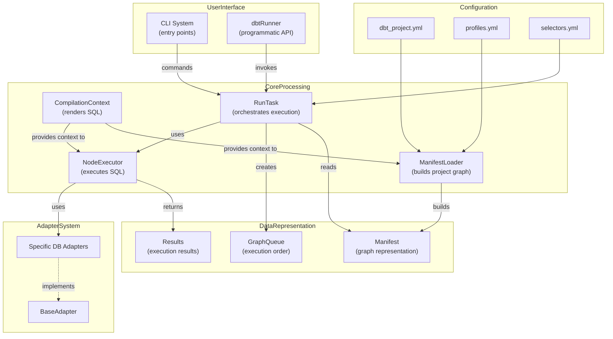
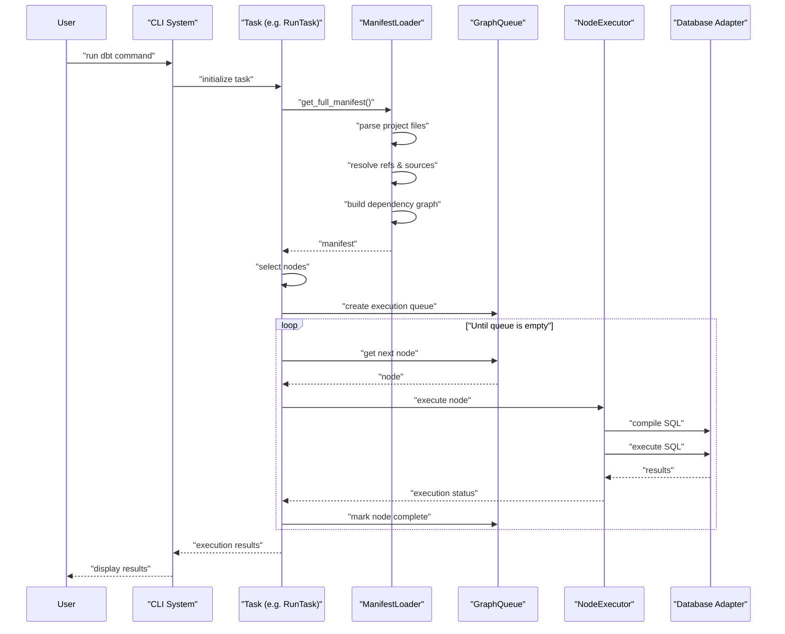

# Overview

<details>
<summary>Relevant source files</summary>

The following files were used as context for generating this wiki page:

- [.changes/0.0.0.md](https://github.com/dbt-labs/dbt-core/blob/64b58ec6/.changes/0.0.0.md)

</details>


This page introduces dbt-core, its purpose, architecture, and key components. It provides a high-level understanding of the system to help developers and contributors understand how dbt-core works.

## What is dbt-core?

dbt-core (data build tool) is a transformation framework that enables data analysts and engineers to transform data using software engineering best practices. It allows users to transform data by writing SQL select statements while dbt handles converting these statements into tables and views in a data warehouse.

The core functionality of dbt includes:

- Building and managing relationships between models
- Providing a templating system (Jinja) for SQL generation
- Testing data quality
- Documentation generation
- Dependency management
- Incremental model updates
- Snapshots for slowly changing dimensions

Sources: [README.md:10-18](https://github.com/dbt-labs/dbt-core/blob/64b58ec6/README.md#L10-L18)

## High-Level Architecture

The following diagram illustrates the high-level architecture of dbt-core:



Sources: [core/setup.py:45-47](https://github.com/dbt-labs/dbt-core/blob/64b58ec6/core/setup.py#L45-L47), [README.md:10-21](https://github.com/dbt-labs/dbt-core/blob/64b58ec6/README.md#L10-L21)

## Core Execution Flow

The following sequence diagram shows how dbt-core executes a typical command:



Sources: [core/setup.py:45-47](https://github.com/dbt-labs/dbt-core/blob/64b58ec6/core/setup.py#L45-L47)

## Key Components

### 1. Command-Line Interface (CLI)

The CLI is the primary way users interact with dbt. It provides commands like `run`, `test`, `docs`, etc., and is implemented using the Click library. The entry point for the CLI is defined in `dbt.cli.main:cli`.

```
dbt <command> [options]
```

For programmatic usage, dbt provides `dbtRunner`, a Python API to invoke dbt commands from code.

For more details on the CLI system, see [CLI System](#4).

Sources: [core/setup.py:45-47](https://github.com/dbt-labs/dbt-core/blob/64b58ec6/core/setup.py#L45-L47)

### 2. ManifestLoader and Parser

The ManifestLoader is responsible for parsing all project files (SQL models, YAML files, macros, etc.) and building a comprehensive graph representation called the Manifest. This component:

- Parses SQL files to extract model definitions
- Processes schema YAML files for sources, tests, and documentation
- Loads macros and makes them available for rendering
- Resolves dependencies between models using `ref()` and `source()` calls
- Builds the node dependency graph

For more details on the parsing system, see [Project Parsing System](#3).

Sources: [README.md:16-18](https://github.com/dbt-labs/dbt-core/blob/64b58ec6/README.md#L16-L18)

### 3. Compilation and Execution System

Once the manifest is built, dbt's execution system:

- Selects nodes based on user criteria (e.g., specific models, tags)
- Determines the execution order based on dependencies
- Compiles SQL by rendering Jinja templates
- Executes the compiled SQL against the target database
- Collects and reports execution results

For more details, see [Core Execution System](#2) and [RunTask and Node Execution](#2.1).

### 4. Database Adapters

dbt uses adapters to communicate with different database systems. Each adapter implements:

- Connection management
- SQL compilation specific to the database dialect
- Database-specific materialization strategies
- Metadata operations (e.g., creating schemas, listing tables)

The adapter system allows dbt to support many different databases while maintaining consistent behavior.

### 5. Context System

The Context system provides variables and functions for use in Jinja templates. Key functions include:

- `ref()`: Reference other models
- `source()`: Reference source tables
- `config()`: Set model-specific configurations
- `env_var()`: Access environment variables

For more details, see [Jinja Templating and Parsing](#3.2).

## Configuration

dbt projects are configured through several files:

### dbt_project.yml

The main project configuration file that defines:

- Project name and version
- Source directories
- Model materialization settings
- Custom configurations

### profiles.yml

Defines database connection details:

- Target database type (e.g., Snowflake, BigQuery)
- Authentication credentials
- Default schemas
- Connection parameters

For more details, see [Configuration System](#5).

## Version and Compatibility

dbt-core is currently at version 1.10.0b2. It requires Python 3.9 or higher and supports Python versions up to 3.13.

Key dependencies include:
- Jinja2 for templating
- Click for CLI functionality
- Various other libraries for data processing and configuration

Sources: [core/setup.py:28](https://github.com/dbt-labs/dbt-core/blob/64b58ec6/core/setup.py#L28), [core/dbt/version.py:229](https://github.com/dbt-labs/dbt-core/blob/64b58ec6/core/dbt/version.py#L229), [.bumpversion.cfg:2](https://github.com/dbt-labs/dbt-core/blob/64b58ec6/.bumpversion.cfg#L2)

## Conclusion

dbt-core provides a powerful framework for data transformation, enabling analysts and engineers to work with SQL using software engineering best practices. Its architecture supports extensibility, modularity, and reliability through components like the manifest system, adapters, and context providers.