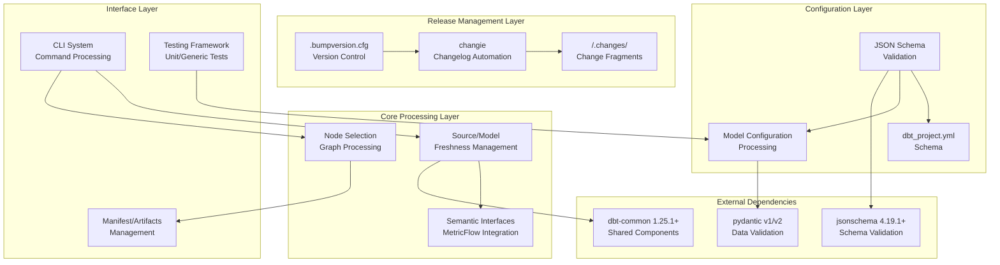
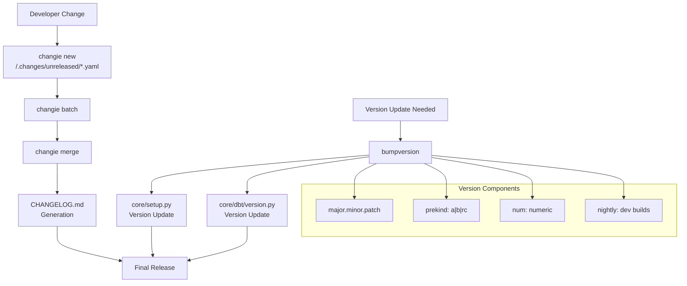
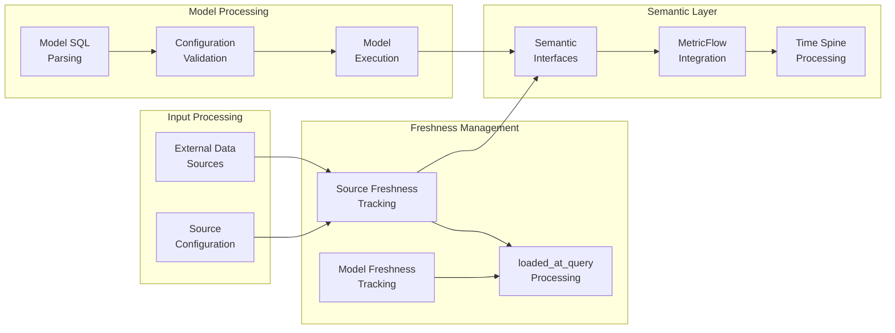
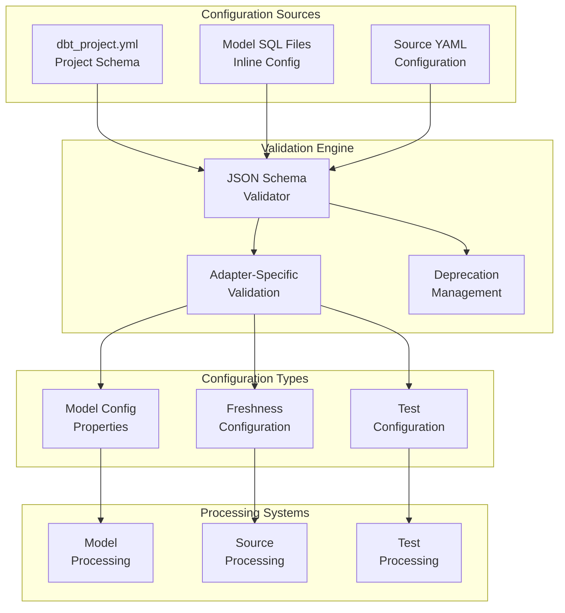
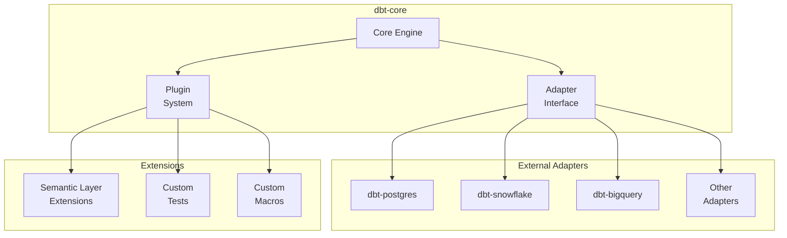

# Architecture Overview

Relevant source files

The following files were used as context for generating this wiki page:

- [.bumpversion.cfg](https://github.com/dbt-labs/dbt-core/blob/64b58ec6/.bumpversion.cfg)
- [.changes/README.md](https://github.com/dbt-labs/dbt-core/blob/64b58ec6/.changes/README.md)

## Purpose and Scope

This document provides a high-level overview of dbt-core's system architecture, focusing on the major subsystems and their interactions. It covers the release management pipeline, configuration validation systems, and core processing components that enable dbt's data transformation capabilities.

For detailed information about specific subsystems, see:
- Core execution systems: [Core Execution System](#2)
- Configuration validation: [Configuration Validation and JSON Schema](#3.1)
- Release management details: [Release Process and Version Management](#11.1)
- Changelog automation: [Changelog Automation](#11.2)

## Overall System Architecture

dbt-core is structured as a modular system with distinct layers for release management, configuration validation, data processing, and external integrations.

### High-Level Component Architecture

**Sources:** [.bumpversion.cfg:1-38](https://github.com/dbt-labs/dbt-core/blob/64b58ec6/.bumpversion.cfg#L1-L38), [.changes/README.md:1-54](https://github.com/dbt-labs/dbt-core/blob/64b58ec6/.changes/README.md#L1-L54)

## Release and Version Management

The release management system uses automated tooling to maintain version consistency and generate documentation.

### Version Management Pipeline

The version management system supports semantic versioning with pre-release and nightly build capabilities. The `bumpversion` tool manages version strings across multiple files using a regex pattern that parses version components [.bumpversion.cfg:3-12]().

**Sources:** [.bumpversion.cfg:1-38](https://github.com/dbt-labs/dbt-core/blob/64b58ec6/.bumpversion.cfg#L1-L38), [.changes/README.md:13-47](https://github.com/dbt-labs/dbt-core/blob/64b58ec6/.changes/README.md#L13-L47)

## Core Processing Systems

The core processing layer handles data transformation, freshness tracking, and semantic layer integration.

### Data Processing Flow

**Sources:** [.changes/README.md:1-54](https://github.com/dbt-labs/dbt-core/blob/64b58ec6/.changes/README.md#L1-L54)

## Configuration and Validation Architecture

The configuration system uses JSON schema validation to ensure project consistency and provide structured validation across different configuration types.

### Configuration Validation Flow

**Sources:** [.changes/README.md:1-54](https://github.com/dbt-labs/dbt-core/blob/64b58ec6/.changes/README.md#L1-L54)

## Integration and Dependency Architecture

dbt-core integrates with external dependencies and provides extension points for adapters and plugins.

### Dependency Integration

| Component | Dependency | Version Requirement | Purpose |
|-----------|------------|-------------------|---------|
| Schema Validation | `jsonschema` | 4.19.1+ | JSON schema validation |
| Data Validation | `pydantic` | v1/v2 support | Configuration parsing |
| Shared Components | `dbt-common` | 1.25.1+ | Core utilities |
| Semantic Layer | `dbt-semantic-interfaces` | 0.9.0+ | MetricFlow integration |

### Extension Architecture

**Sources:** [.changes/README.md:1-54](https://github.com/dbt-labs/dbt-core/blob/64b58ec6/.changes/README.md#L1-L54)