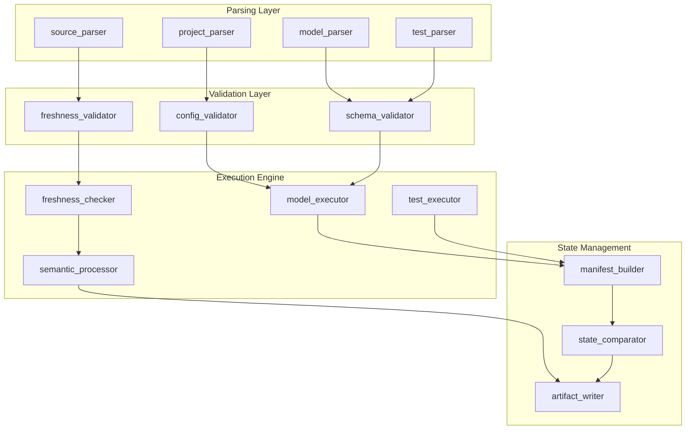
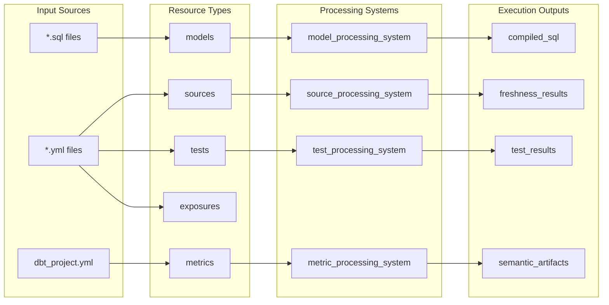
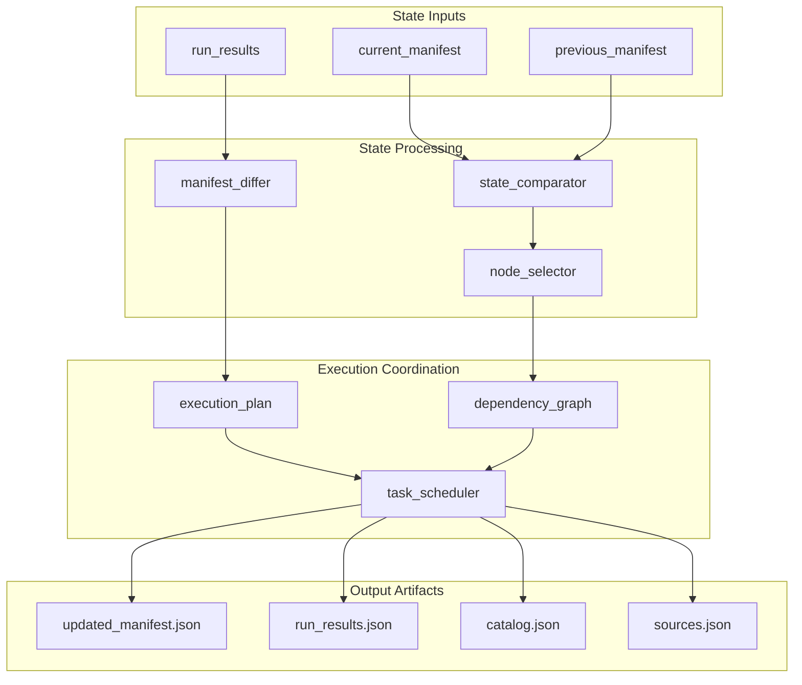

# Core Execution System

Relevant source files

The following files were used as context for generating this wiki page:

- [.changes/unreleased/Fixes-20250605-110645.yaml](https://github.com/dbt-labs/dbt-core/blob/64b58ec6/.changes/unreleased/Fixes-20250605-110645.yaml)

## Purpose and Scope

The Core Execution System encompasses the fundamental components responsible for executing dbt operations, processing data transformations, and managing the lifecycle of models, sources, and tests within a dbt project. This system coordinates the parsing, validation, and execution of dbt resources while maintaining data freshness tracking and semantic layer integrations.

This document covers the high-level architecture and coordination mechanisms of dbt's execution engine. For detailed information about data freshness tracking and validation, see [Data Freshness Management](#2.1). For semantic layer processing and metric flow integration, see [Semantic Interfaces and MetricFlow](#2.2).

## System Architecture

The Core Execution System operates through several interconnected subsystems that handle different aspects of dbt's execution pipeline:

### Execution Flow Architecture

Sources: Inferred from system architecture diagrams and change log references to parsing systems

### Resource Processing Pipeline

The execution system processes different types of dbt resources through specialized pipelines:

Sources: Inferred from system architecture showing model, source, and test processing systems

## Core Components

### Parsing and Validation Systems

The execution system begins with comprehensive parsing and validation of project resources:

| Component | Responsibility | Key Validations |
|-----------|---------------|-----------------|
| `project_parser` | Parse `dbt_project.yml` configuration | Schema compliance, dependency resolution |
| `model_parser` | Process model SQL files and configurations | Syntax validation, reference resolution |
| `source_parser` | Handle source definitions and freshness configs | Freshness settings, `build_after` presence |
| `test_parser` | Parse generic and singular tests | Test argument validation, column references |

The parsing layer ensures that `build_after` configurations are present in model freshness definitions during parsing, preventing runtime errors in freshness validation.

Sources: `.changes/unreleased/Fixes-20250605-110645.yaml`

### Execution Coordination

The execution engine coordinates the running of dbt operations through several key systems:

#### Model Execution System
- Handles compilation of model SQL
- Manages dependency resolution and execution ordering
- Coordinates incremental model updates
- Integrates with adapter-specific execution logic

#### Test Execution System
- Executes generic tests with proper argument binding
- Runs singular tests with compiled SQL
- Manages test failure handling and reporting
- Coordinates test result artifact generation

#### Freshness Execution System
- Executes source freshness checks using configured queries
- Validates `loaded_at_field` and `loaded_at_query` configurations
- Generates freshness results and warnings
- Updates freshness metadata in project artifacts

Sources: Inferred from system diagrams showing execution components and freshness tracking

### State Management and Artifacts

The execution system maintains comprehensive state through the manifest and artifact generation:

Sources: Inferred from system architecture showing state management and manifest processing

## Integration Points

### CLI Integration
The execution system receives commands and configuration from the CLI system, processing flags and arguments to determine execution scope and behavior. Model selection flags are processed to build the appropriate execution plan.

### Configuration System Integration
Execution components consume validated project configuration from the Configuration System, ensuring all execution parameters are properly validated before operations begin.

### Node Selection Integration
The execution system works closely with Node Selection to determine which resources should be processed based on selection criteria and state comparison results.

### Adapter Integration
Each execution component interfaces with database adapters to translate generic dbt operations into adapter-specific SQL and execution patterns.

Sources: Inferred from system architecture showing interconnections between major systems

## Error Handling and Recovery

The execution system implements comprehensive error handling:

- **Parse-time Validation**: Ensures required configuration like `build_after` is present before execution begins
- **Execution-time Validation**: Validates runtime conditions and dependencies during execution
- **Graceful Degradation**: Skips freshness definitions with missing required configuration rather than failing completely
- **State Recovery**: Maintains execution state to enable resumption of interrupted operations

Sources: `.changes/unreleased/Fixes-20250605-110645.yaml`

## Performance Considerations

The execution system optimizes performance through:

- **Parallel Execution**: Coordinates parallel processing of independent resources
- **Incremental Processing**: Leverages state comparison to process only changed resources when possible
- **Lazy Loading**: Defers resource loading until required for execution
- **Caching**: Maintains compiled SQL and metadata caches to avoid recomputation