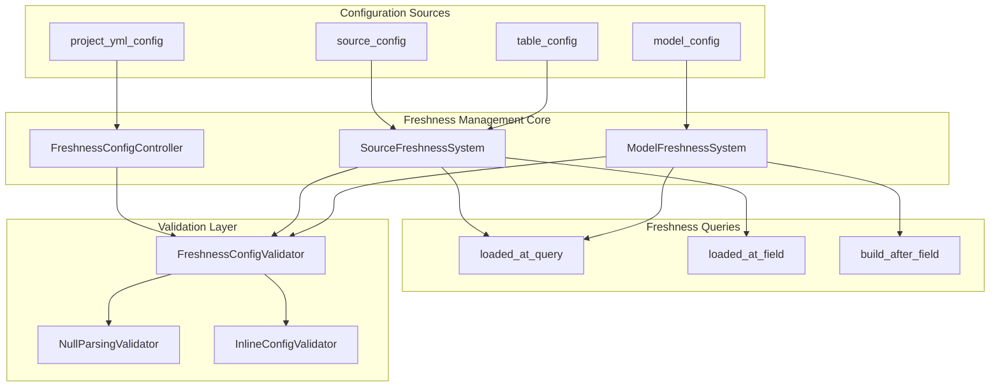
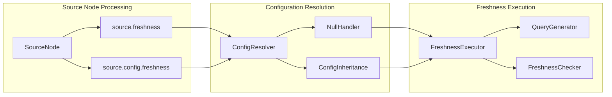
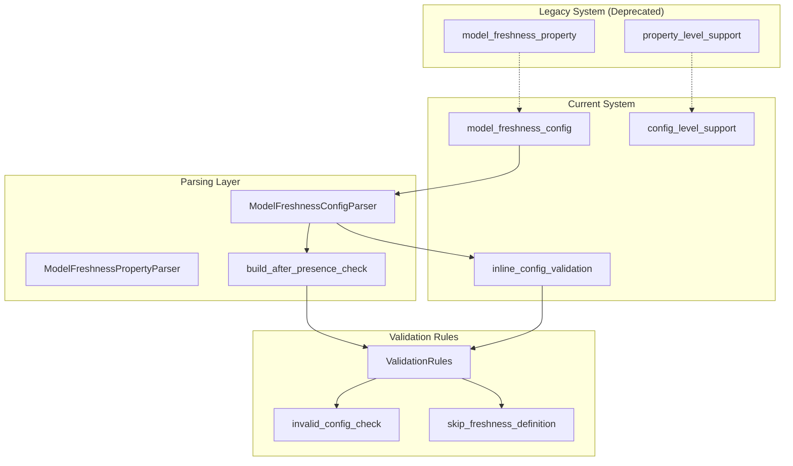
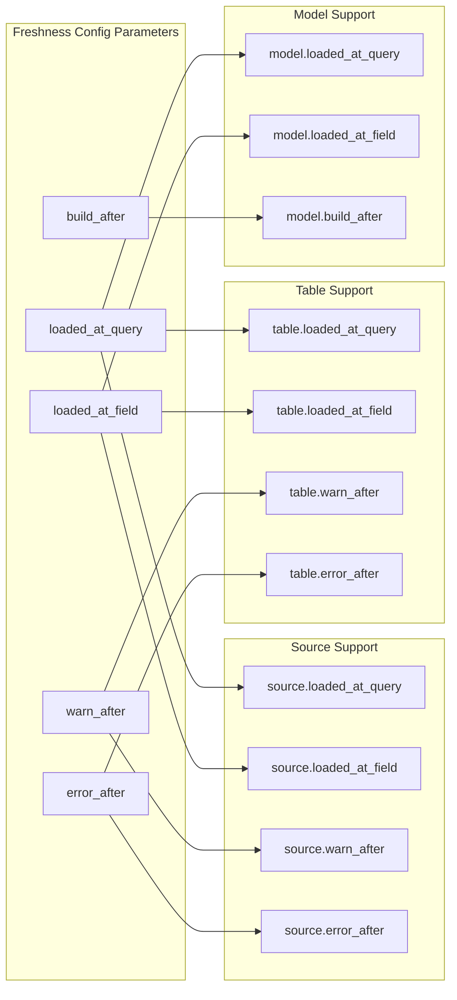
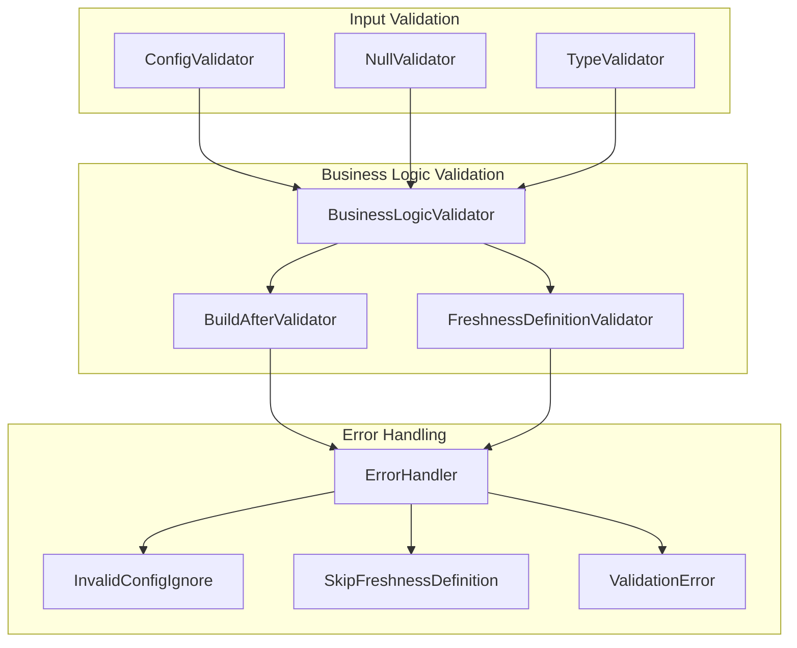

# Data Freshness Management

Relevant source files

The following files were used as context for generating this wiki page:

- [.changes/unreleased/Features-20250623-113130.yaml](https://github.com/dbt-labs/dbt-core/blob/64b58ec6/.changes/unreleased/Features-20250623-113130.yaml)
- [.changes/unreleased/Fixes-20250530-005804.yaml](https://github.com/dbt-labs/dbt-core/blob/64b58ec6/.changes/unreleased/Fixes-20250530-005804.yaml)
- [.changes/unreleased/Fixes-20250605-110645.yaml](https://github.com/dbt-labs/dbt-core/blob/64b58ec6/.changes/unreleased/Fixes-20250605-110645.yaml)
- [.changes/unreleased/Fixes-20250609-175239.yaml](https://github.com/dbt-labs/dbt-core/blob/64b58ec6/.changes/unreleased/Fixes-20250609-175239.yaml)
- [.changes/unreleased/Fixes-20250610-211241.yaml](https://github.com/dbt-labs/dbt-core/blob/64b58ec6/.changes/unreleased/Fixes-20250610-211241.yaml)
- [.changes/unreleased/Fixes-20250616-085600.yaml](https://github.com/dbt-labs/dbt-core/blob/64b58ec6/.changes/unreleased/Fixes-20250616-085600.yaml)

The Data Freshness Management system in dbt-core provides functionality for tracking and validating the recency of data in both source tables and derived models. This system enables users to configure freshness checks that monitor when data was last loaded or updated, ensuring data quality and timeliness in data pipelines.

For information about configuration validation and JSON schema processing, see [Configuration Validation and JSON Schema](#3.1). For project-level configuration management, see [Project Configuration and Schema](#5.1).

## System Overview

The freshness management system operates on two primary entities: source tables and models. It supports configurable freshness checks through `loaded_at_query` and `loaded_at_field` configurations, allowing flexible monitoring strategies for different data patterns.

Sources: [.changes/unreleased/Features-20250623-113130.yaml:1-7](https://github.com/dbt-labs/dbt-core/blob/64b58ec6/.changes/unreleased/Features-20250623-113130.yaml#L1-L7), [.changes/unreleased/Fixes-20250530-005804.yaml:1-7](https://github.com/dbt-labs/dbt-core/blob/64b58ec6/.changes/unreleased/Fixes-20250530-005804.yaml#L1-L7)

## Source Freshness Management

Source freshness tracking monitors the recency of data in external source tables. The system supports configuration through both `loaded_at_query` and `loaded_at_field` options, providing flexibility for different source table schemas and data loading patterns.

### Source Configuration Processing

The source freshness system processes configurations from multiple levels, with proper handling of explicit null values and configuration inheritance.

The system ensures that `source.freshness` equals `source.config.freshness` for consistency across the node representation.

Sources: [.changes/unreleased/Fixes-20250530-005804.yaml:1-7](https://github.com/dbt-labs/dbt-core/blob/64b58ec6/.changes/unreleased/Fixes-20250530-005804.yaml#L1-L7), [.changes/unreleased/Fixes-20250609-175239.yaml:1-7](https://github.com/dbt-labs/dbt-core/blob/64b58ec6/.changes/unreleased/Fixes-20250609-175239.yaml#L1-L7)

## Model Freshness Management

Model freshness tracking monitors the recency of derived models and materialized tables. This system has undergone recent architectural changes to standardize configuration handling and improve validation.

### Model Freshness Configuration Evolution

Recent changes have moved model freshness configuration from property-level to config-level support, providing better consistency with the overall dbt configuration system.

The parsing system now ensures that `build_after` is present in model freshness definitions, otherwise it skips the freshness definition entirely.

Sources: [.changes/unreleased/Fixes-20250605-110645.yaml:1-8](https://github.com/dbt-labs/dbt-core/blob/64b58ec6/.changes/unreleased/Fixes-20250605-110645.yaml#L1-L8), [.changes/unreleased/Fixes-20250616-085600.yaml:1-7](https://github.com/dbt-labs/dbt-core/blob/64b58ec6/.changes/unreleased/Fixes-20250616-085600.yaml#L1-L7), [.changes/unreleased/Fixes-20250610-211241.yaml:1-7](https://github.com/dbt-labs/dbt-core/blob/64b58ec6/.changes/unreleased/Fixes-20250610-211241.yaml#L1-L7)

## Configuration System Architecture

The freshness management system integrates with dbt-core's hierarchical configuration system, supporting both source and table-level configuration inheritance.

### Configuration Hierarchy

| Configuration Level | Source Freshness | Model Freshness | Table Freshness |
|-------------------|------------------|-----------------|-----------------|
| Project Level | ✓ | ✓ | ✓ |
| Source Level | ✓ | - | - |
| Model Level | - | ✓ | - |
| Table Level | - | - | ✓ |
| Inline Config | - | ✓ | ✓ |

### Supported Configuration Parameters

The system supports the following freshness configuration parameters across different entity types:

Sources: [.changes/unreleased/Features-20250623-113130.yaml:1-7](https://github.com/dbt-labs/dbt-core/blob/64b58ec6/.changes/unreleased/Features-20250623-113130.yaml#L1-L7)

## Validation and Error Handling

The freshness management system includes robust validation and error handling mechanisms to ensure configuration correctness and provide clear feedback for invalid configurations.

### Validation Pipeline

The validation system handles several key scenarios:
- Explicit null handling in source freshness configurations
- Missing `build_after` fields in model freshness definitions
- Invalid inline model configuration validation
- Configuration consistency checks between node properties and config objects

Sources: [.changes/unreleased/Fixes-20250530-005804.yaml:1-7](https://github.com/dbt-labs/dbt-core/blob/64b58ec6/.changes/unreleased/Fixes-20250530-005804.yaml#L1-L7), [.changes/unreleased/Fixes-20250605-110645.yaml:1-8](https://github.com/dbt-labs/dbt-core/blob/64b58ec6/.changes/unreleased/Fixes-20250605-110645.yaml#L1-L8), [.changes/unreleased/Fixes-20250610-211241.yaml:1-7](https://github.com/dbt-labs/dbt-core/blob/64b58ec6/.changes/unreleased/Fixes-20250610-211241.yaml#L1-L7), [.changes/unreleased/Fixes-20250609-175239.yaml:1-7](https://github.com/dbt-labs/dbt-core/blob/64b58ec6/.changes/unreleased/Fixes-20250609-175239.yaml#L1-L7)

## Recent System Improvements

The freshness management system has undergone significant improvements to enhance reliability and standardize configuration handling:

### Key Enhancements

1. **Extended Configuration Support**: Added `loaded_at_query` and `loaded_at_field` support for both source and table configurations, providing greater flexibility in freshness monitoring strategies.

2. **Improved Null Handling**: Enhanced the system's ability to handle explicit null values in source freshness configurations, preventing configuration resolution errors.

3. **Standardized Model Configuration**: Moved from property-level to config-level support for model freshness, aligning with dbt-core's configuration patterns and improving consistency.

4. **Enhanced Validation**: Implemented stricter validation rules for model freshness definitions, ensuring required fields are present before processing.

5. **Configuration Consistency**: Established consistency between node freshness properties and configuration objects, eliminating discrepancies in node representation.