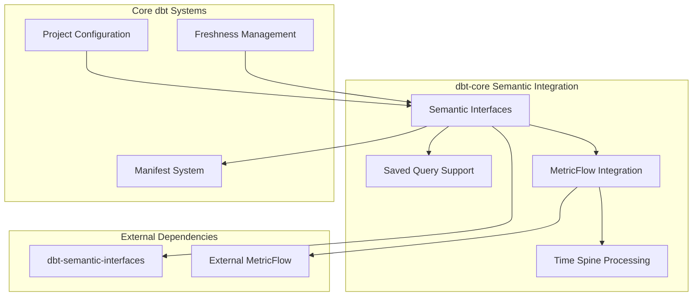
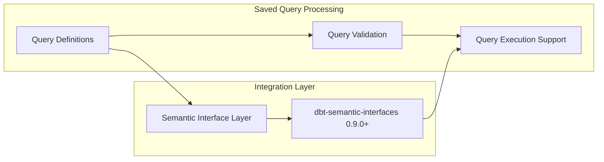
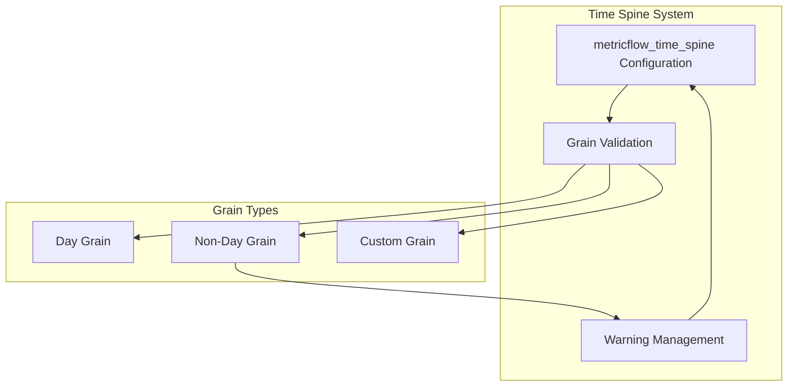
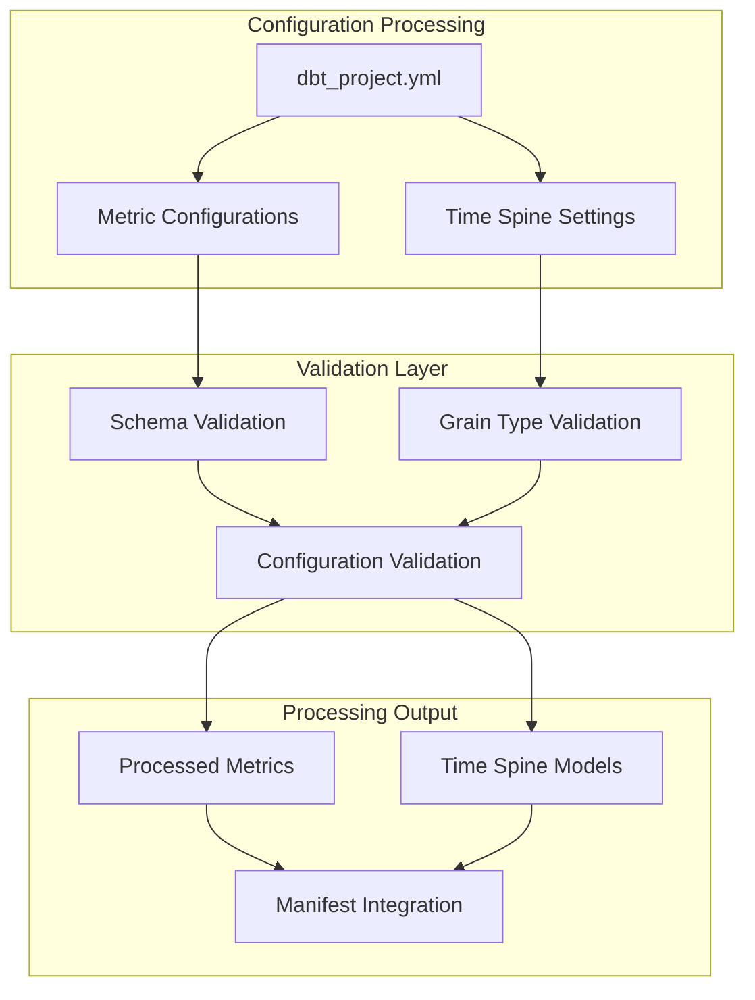
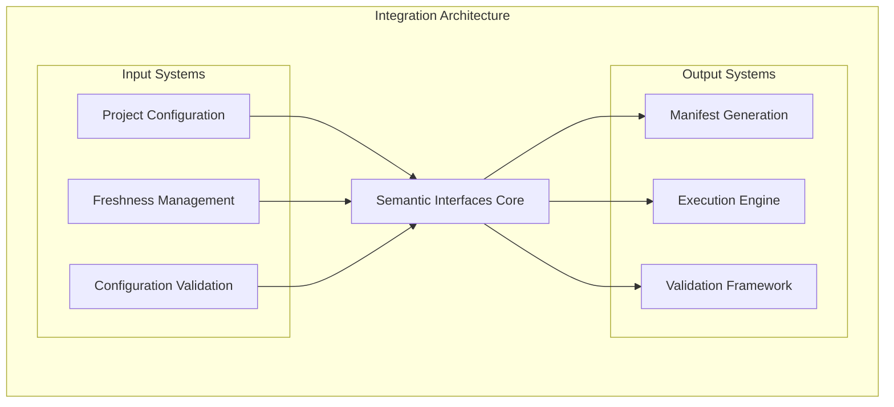

# Semantic Interfaces and MetricFlow

Relevant source files

The following files were used as context for generating this wiki page:

- [.changes/unreleased/Dependencies-20250709-132213.yaml](https://github.com/dbt-labs/dbt-core/blob/64b58ec6/.changes/unreleased/Dependencies-20250709-132213.yaml)
- [.changes/unreleased/Fixes-20250528-092055.yaml](https://github.com/dbt-labs/dbt-core/blob/64b58ec6/.changes/unreleased/Fixes-20250528-092055.yaml)

## Purpose and Scope

This document covers dbt-core's integration with semantic interfaces and MetricFlow systems, including saved query support and time spine processing. This system enables dbt to work with metric definitions and semantic layer functionality through the `dbt-semantic-interfaces` dependency.

For information about data freshness management that integrates with semantic interfaces, see [Data Freshness Management](#2.1). For details on semantic layer dependencies, see [Semantic Dependencies](#9.2).

## System Architecture

The semantic interfaces system provides integration between dbt-core and external semantic layer tools, primarily through the `dbt-semantic-interfaces` library. This system handles metric definitions, saved queries, and time spine configurations.

**Sources:** `.changes/unreleased/Dependencies-20250709-132213.yaml`, system architecture analysis

## Saved Query Support

The semantic interfaces system provides support for saved queries through integration with `dbt-semantic-interfaces`. This functionality has been enhanced with the upgrade to version 0.9.0.

### Saved Query Integration

The system handles saved query definitions and provides validation and execution support through the semantic interfaces integration. The recent upgrade to `dbt-semantic-interfaces==0.9.0` provides more robust saved query functionality.

**Sources:** `.changes/unreleased/Dependencies-20250709-132213.yaml`

## MetricFlow Integration

MetricFlow integration enables dbt to work with metric definitions and time-based data processing. The system includes specific handling for time spine configurations.

### Time Spine Processing

The system provides specific handling for `metricflow_time_spine` configurations with different granularities. A recent fix addressed warning issues for non-day grain time spine configurations.

The fix ensures that `metricflow_time_spine` configurations with non-day grains do not trigger inappropriate warnings, improving the user experience when working with different time granularities.

**Sources:** `.changes/unreleased/Fixes-20250528-092055.yaml`

### MetricFlow Configuration Processing

**Sources:** System architecture analysis based on change files

## Dependency Management

The semantic interfaces system relies on the `dbt-semantic-interfaces` external dependency, which provides the core functionality for metric definitions and semantic layer integration.

| Component | Version | Purpose |
|-----------|---------|---------|
| dbt-semantic-interfaces | 0.9.0+ | Core semantic layer functionality |
| MetricFlow | External | Metric processing and time spine handling |

### Version Upgrades

The system has been upgraded to use `dbt-semantic-interfaces==0.9.0`, which provides:
- More robust saved query support
- Enhanced metric definition handling
- Improved integration stability

**Sources:** `.changes/unreleased/Dependencies-20250709-132213.yaml`

## Integration Points

The semantic interfaces system integrates with several other dbt-core systems:

The semantic interfaces system serves as a bridge between dbt's configuration and execution systems and external semantic layer tools, enabling metric-driven data transformation workflows.