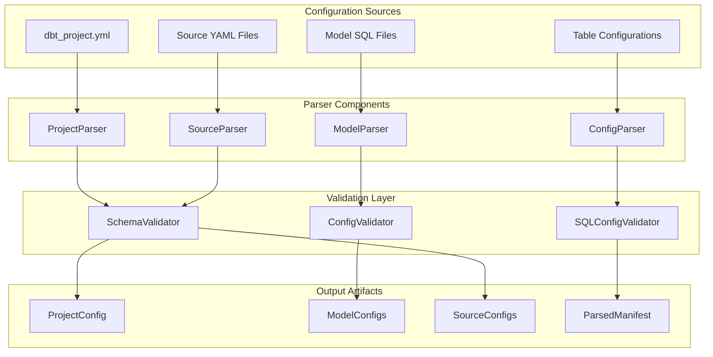
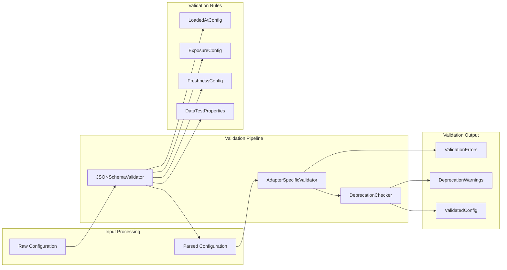
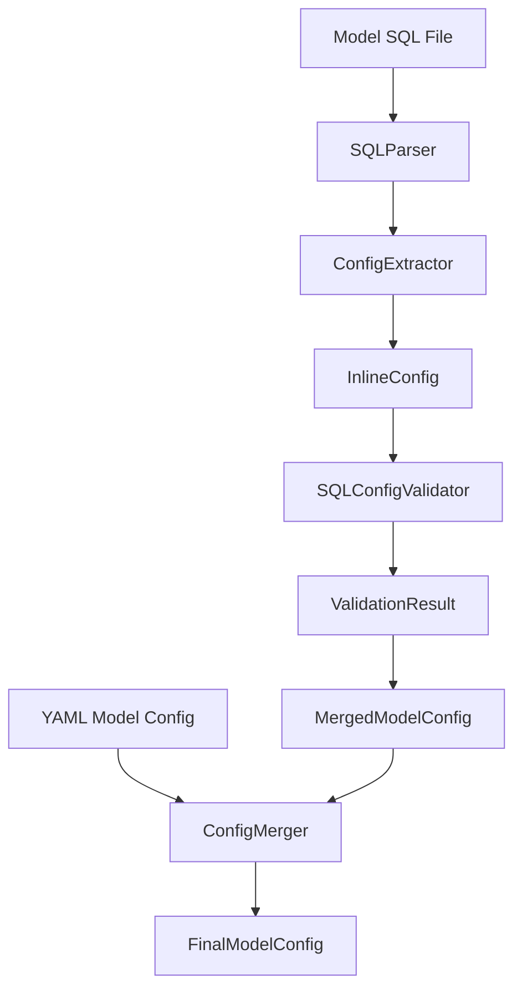

# Project Parsing System

Relevant source files

The following files were used as context for generating this wiki page:

- [.changes/unreleased/Features-20250625-151818.yaml](https://github.com/dbt-labs/dbt-core/blob/64b58ec6/.changes/unreleased/Features-20250625-151818.yaml)

## Purpose and Scope

The Project Parsing System is responsible for parsing project configurations, validating schemas, and processing model definitions within dbt-core. This system serves as the foundation for transforming raw configuration files and SQL model definitions into validated, structured representations that can be consumed by the execution engine.

The system handles parsing from multiple configuration sources including `dbt_project.yml`, model SQL files, source configurations, and table configurations. For information about the underlying JSON schema validation mechanisms, see [Configuration Validation and JSON Schema](#3.1). For details about model-specific configuration processing, see [Model Configuration Processing](#3.2).

## System Architecture

The Project Parsing System operates as a multi-stage pipeline that ingests various configuration sources, applies validation rules, and produces structured configuration objects for downstream processing.

### Core Parsing Pipeline

Sources: *.changes/unreleased/Features-20250625-151818.yaml*

### Configuration Source Processing

The system processes configuration data from multiple sources, each with distinct parsing requirements and validation rules:

| Configuration Source | Parser Component | Primary Validation | Output Type |
|---------------------|------------------|-------------------|-------------|
| `dbt_project.yml` | `ProjectParser` | JSON Schema | `ProjectConfig` |
| Model SQL Files | `ModelParser` | SQL Config Validation | `ModelConfig` |
| Source YAML Files | `SourceParser` | Source Schema | `SourceConfig` |
| Table Configurations | `ConfigParser` | Config Schema | `TableConfig` |

## Schema Validation Integration

Sources: *.changes/unreleased/Features-20250625-151818.yaml*

## Model SQL Configuration Processing

Recent developments in the parsing system include validation of configurations directly from model SQL files, as indicated by the feature addition for validating configs from model SQL files. This enhancement allows the system to extract and validate configuration parameters embedded within SQL model definitions.

### SQL Configuration Extraction Flow

The system now processes configuration data embedded within SQL files, enabling more cohesive model definitions where configuration and logic coexist within the same file.

Sources: *.changes/unreleased/Features-20250625-151818.yaml*

## Error Handling and Validation Reporting

The parsing system implements comprehensive error handling to provide meaningful feedback when configuration parsing or validation fails:

- **Schema Validation Errors**: Reported when configurations don't conform to expected JSON schemas
- **SQL Configuration Errors**: Reported when inline SQL configurations are malformed or invalid
- **Deprecation Warnings**: Generated when deprecated configuration patterns are detected
- **Adapter Compatibility Warnings**: Issued when configurations may not be compatible with specific database adapters

## Integration Points

The Project Parsing System integrates with several other dbt-core systems:

- **Manifest System**: Provides parsed configurations for manifest generation (see [Manifest and Artifacts](#8))
- **Node Selection**: Supplies configuration data for node filtering and selection (see [Node Selection](#7))
- **Execution System**: Provides validated configurations for model execution (see [Core Execution System](#2))
- **CLI System**: Receives configuration overrides and flags from command-line interface (see [CLI System](#4))

## Performance Considerations

The parsing system implements several optimization strategies:

- **Incremental Parsing**: Only re-parses configurations that have changed since the last run
- **Schema Caching**: Caches JSON schemas to avoid repeated validation overhead
- **Parallel Processing**: Processes independent configuration sources concurrently when possible
- **Lazy Loading**: Defers parsing of unused configurations until they are explicitly requested