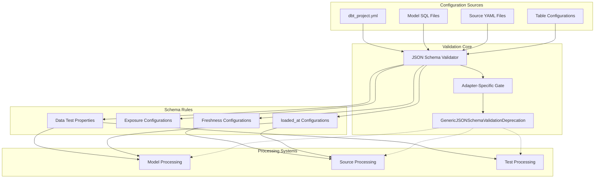
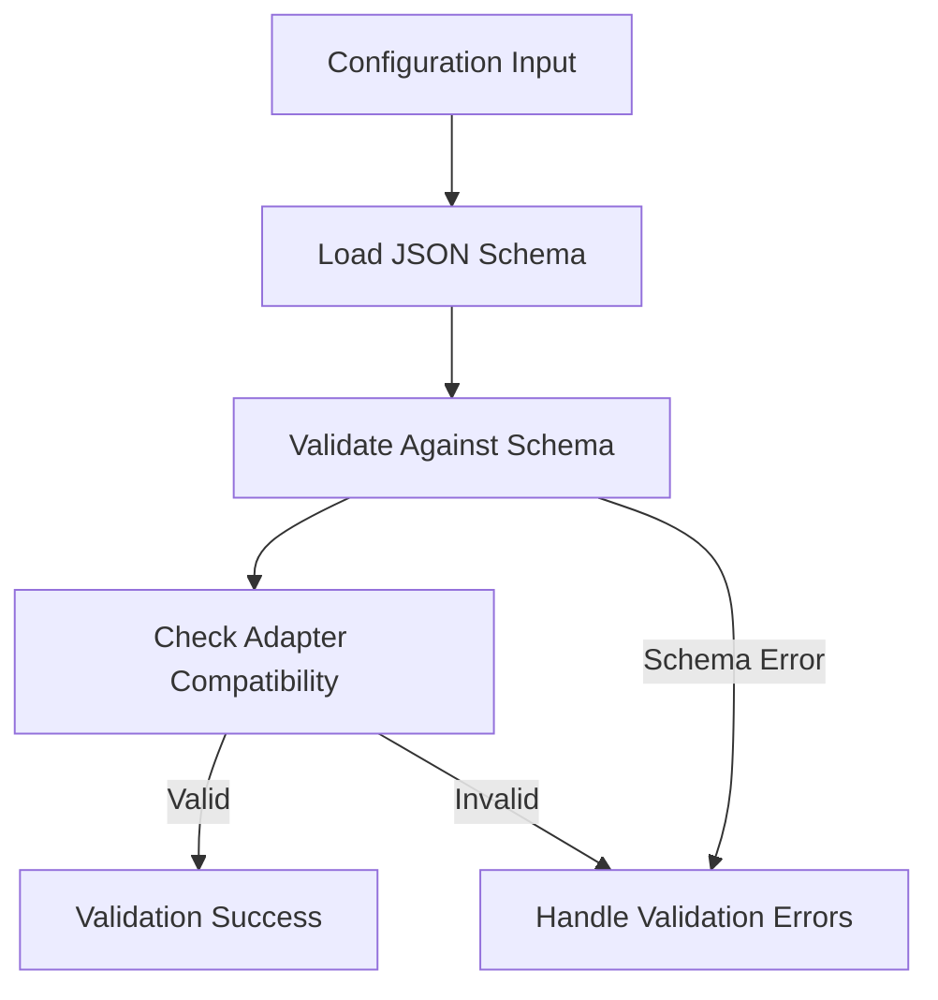
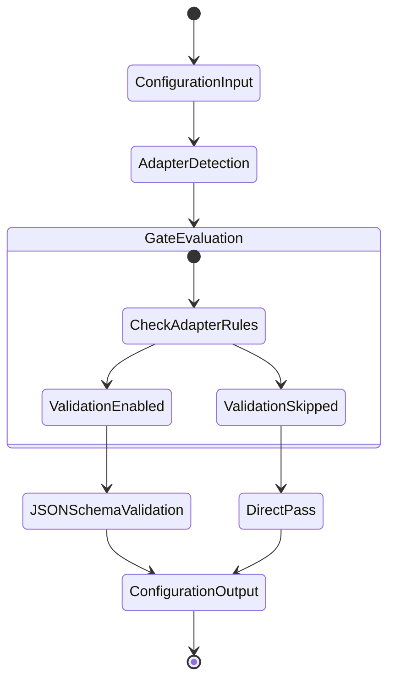
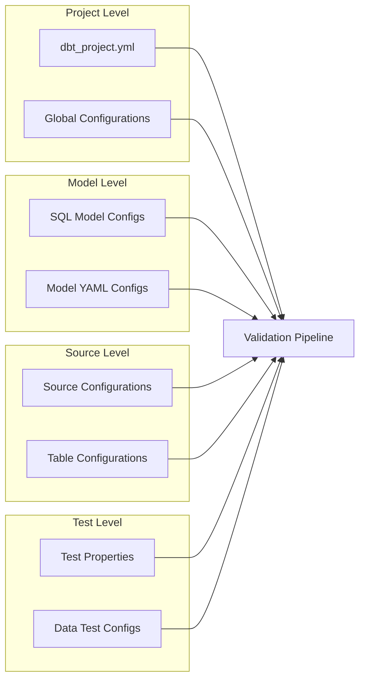
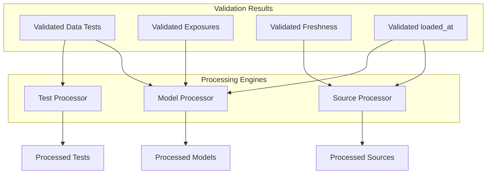

# Configuration Validation and JSON Schema

Relevant source files

The following files were used as context for generating this wiki page:

- [.changes/unreleased/Features-20250714-232524.yaml](https://github.com/dbt-labs/dbt-core/blob/64b58ec6/.changes/unreleased/Features-20250714-232524.yaml)
- [.changes/unreleased/Fixes-20250707-103418.yaml](https://github.com/dbt-labs/dbt-core/blob/64b58ec6/.changes/unreleased/Fixes-20250707-103418.yaml)
- [.changes/unreleased/Fixes-20250710-170148.yaml](https://github.com/dbt-labs/dbt-core/blob/64b58ec6/.changes/unreleased/Fixes-20250710-170148.yaml)

This document covers dbt-core's JSON schema validation system, which provides structured validation for project configurations, model definitions, and other dbt artifacts. The system includes adapter-specific validation gating, schema definition management, and deprecation handling for configuration validation processes.

For information about hierarchical configuration parsing and project-level settings, see [Hierarchical Configuration Parsing](#5.2). For model-specific configuration processing, see [Model Configuration Processing](#3.2).

## Purpose and Scope

The Configuration Validation and JSON Schema system serves as the validation layer for dbt project configurations, ensuring that YAML configurations, SQL model configurations, and other project artifacts conform to expected schemas. The system provides:

- JSON schema-based validation for multiple configuration types
- Adapter-specific validation gating to customize validation behavior
- Deprecation management for evolving configuration standards
- Integration with the broader project parsing pipeline

## System Architecture

**Configuration Validation System Architecture**

Sources: Based on architecture diagrams and change file patterns from `.changes/unreleased/Features-20250714-232524.yaml`, `.changes/unreleased/Fixes-20250707-103418.yaml`

## Core Validation Components

### JSON Schema Validator

The JSON Schema Validator serves as the primary validation engine for dbt configurations. This component processes various configuration sources and applies appropriate schema validation rules.

**Validation Flow**

The validator handles multiple configuration types including:
- Project-level configurations from `dbt_project.yml`
- Model SQL configurations embedded in SQL files
- Source and table configuration definitions
- Test and exposure configurations

Sources: `.changes/unreleased/Features-20250714-232524.yaml`, `.changes/unreleased/Fixes-20250707-103418.yaml`

### Adapter-Specific Validation Gating

The system implements adapter-specific validation gating to customize validation behavior based on the target database adapter. This allows different adapters to have different validation requirements.

| Component | Purpose | Gating Behavior |
|-----------|---------|----------------|
| `adapterGate` | Controls validation scope | Enables/disables validations per adapter |
| `jsonSchemaValidator` | Core validation logic | Respects adapter gating decisions |
| Configuration processors | Apply validated configs | Receive adapter-filtered results |

**Adapter Gating Process**

Sources: `.changes/unreleased/Features-20250714-232524.yaml`

### Deprecation Management

The `GenericJSONSchemaValidationDeprecation` component manages the deprecation of configuration validation features, providing controlled migration paths for evolving validation standards.

Key aspects of deprecation management:
- Preview deprecation status for gradual migration
- Warning generation for deprecated validation patterns
- Compatibility maintenance during transition periods

Sources: `.changes/unreleased/Fixes-20250710-170148.yaml`

## Configuration Sources and Processing

### Configuration Input Types

The validation system processes multiple types of configuration inputs:

**Configuration Source Mapping**

### Schema Definition Updates

Recent updates to the schema definitions include:
- Nested configuration definitions for complex configuration structures
- Cloud integration information handling
- Removal of deprecated source override configurations

Sources: `.changes/unreleased/Fixes-20250707-103418.yaml`

## Validation Rules and Processing

### Rule Categories

The system applies different validation rules based on configuration type:

| Rule Category | Configuration Target | Validation Focus |
|---------------|---------------------|------------------|
| Data Test Properties | Model and source tests | Test argument validation |
| Exposure Configurations | Exposure definitions | Exposure metadata validation |
| Freshness Configurations | Source freshness settings | Freshness parameter validation |
| loaded_at Configurations | Source and model loading | Loading timestamp validation |

### Processing Integration

**Validation to Processing Flow**

Sources: Based on architecture patterns from provided diagrams and change file references

## Recent System Evolution

### Recent Changes

The configuration validation system has undergone several recent improvements:

1. **Adapter Gating Implementation** - Introduction of adapter-specific validation controls
2. **Schema Definition Updates** - Enhanced schema definitions with nested configurations and cloud integration
3. **Deprecation Management** - Conversion of `GenericJSONSchemaValidationDeprecation` to preview status

### Migration Considerations

The system maintains backward compatibility while evolving validation standards:
- Deprecated source overrides are being phased out
- Generic JSON schema validation deprecations provide migration warnings
- Adapter-specific gating allows gradual rollout of new validation rules