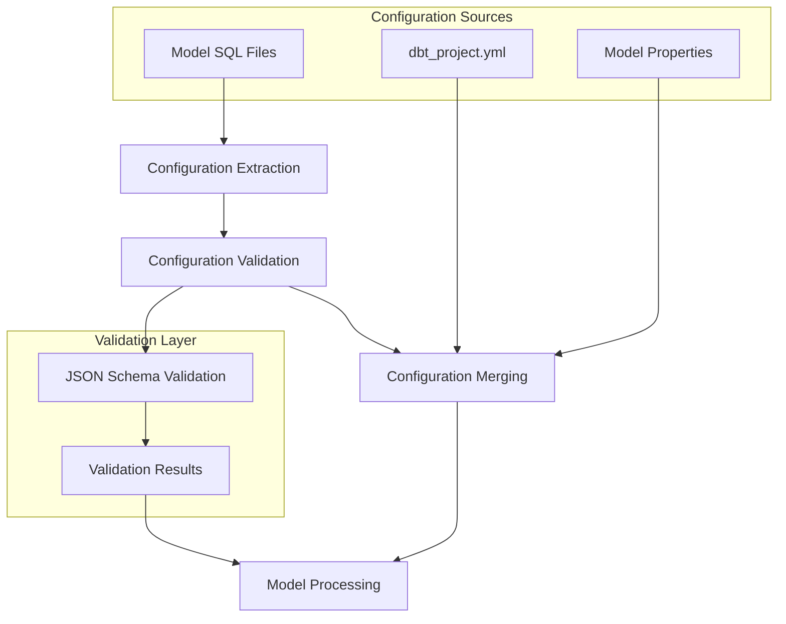
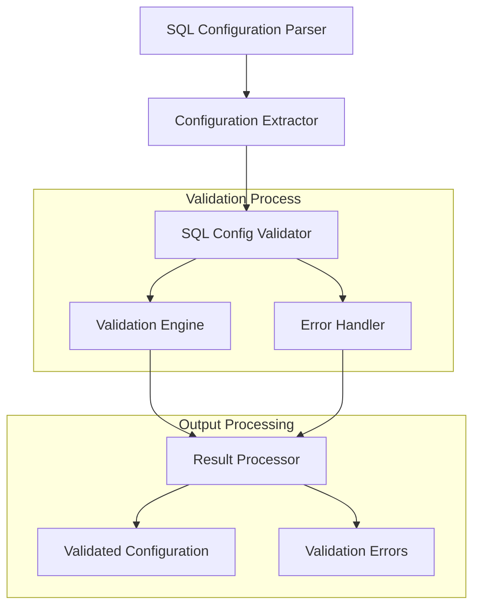
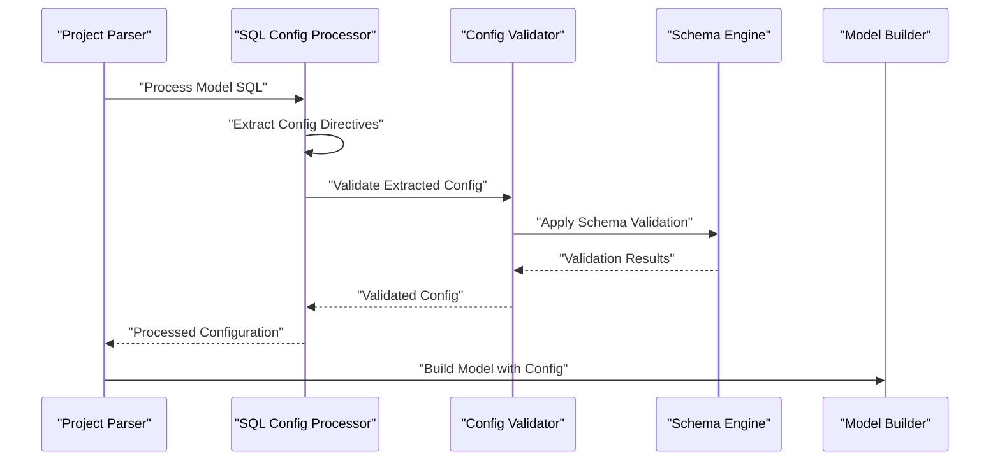
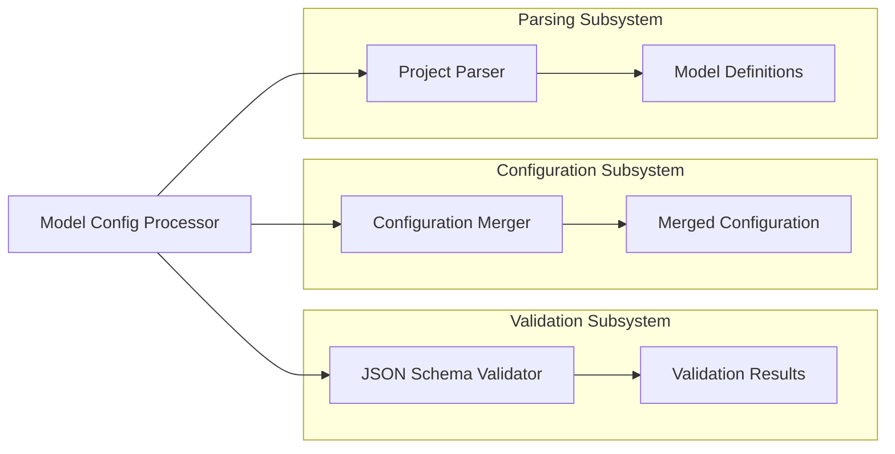

# Model Configuration Processing

Relevant source files

The following files were used as context for generating this wiki page:

- [.changes/unreleased/Features-20250625-151818.yaml](https://github.com/dbt-labs/dbt-core/blob/64b58ec6/.changes/unreleased/Features-20250625-151818.yaml)

## Purpose and Scope

The Model Configuration Processing system handles the parsing, validation, and processing of configuration defined within dbt model SQL files. This system extracts configuration directives from model definitions and validates them against established schemas as part of the broader project parsing workflow.

For information about JSON schema validation and adapter-specific validation, see [Configuration Validation and JSON Schema](#3.1). For project-level configuration management, see [Project Configuration and Schema](#5.1).

## Configuration Sources and Processing Flow

Model configurations in dbt-core can be specified in multiple locations, with SQL file configurations being processed as part of the model parsing pipeline.

### Configuration Processing Pipeline

Sources: `.changes/unreleased/Features-20250625-151818.yaml`

## SQL Configuration Validation

Recent enhancements to the model configuration processing system include the introduction of configuration validation directly from model SQL files. This represents a significant improvement in configuration management capabilities.

### Validation Implementation

The validation system processes configuration directives embedded within model SQL files, ensuring they conform to expected schemas and constraints before being integrated into the broader model processing pipeline.

Sources: `.changes/unreleased/Features-20250625-151818.yaml`

## Integration with Project Parsing

Model configuration processing operates as a component within the larger project parsing system, coordinating with other parsing subsystems to build comprehensive model definitions.

### Configuration Processing Workflow

This workflow ensures that SQL-based configurations are properly validated and integrated into the model definition process, maintaining consistency with other configuration sources.

Sources: `.changes/unreleased/Features-20250625-151818.yaml`

## Configuration Validation Features

The model configuration processing system includes several key validation capabilities:

| Validation Type | Description | Implementation Status |
|-----------------|-------------|----------------------|
| Schema Validation | JSON schema-based validation of configuration structure | Active |
| Type Checking | Validation of configuration value types | Active |
| SQL Config Validation | Direct validation of configs from model SQL files | Recently Added |
| Cross-Reference Validation | Validation of configuration references to other models/sources | Active |

### Recent Enhancements

The system has been enhanced to begin validating configurations directly from model SQL files, addressing issue #11727. This enhancement expands the validation coverage to include configuration directives that are embedded within the model definition itself.

Sources: `.changes/unreleased/Features-20250625-151818.yaml`

## System Architecture Integration

The Model Configuration Processing system integrates with several other dbt-core subsystems:

This architecture ensures that model configuration processing operates seamlessly within the broader dbt-core parsing and validation ecosystem, maintaining consistency and reliability across all configuration sources.