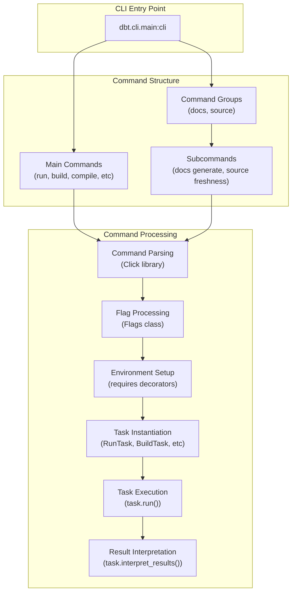
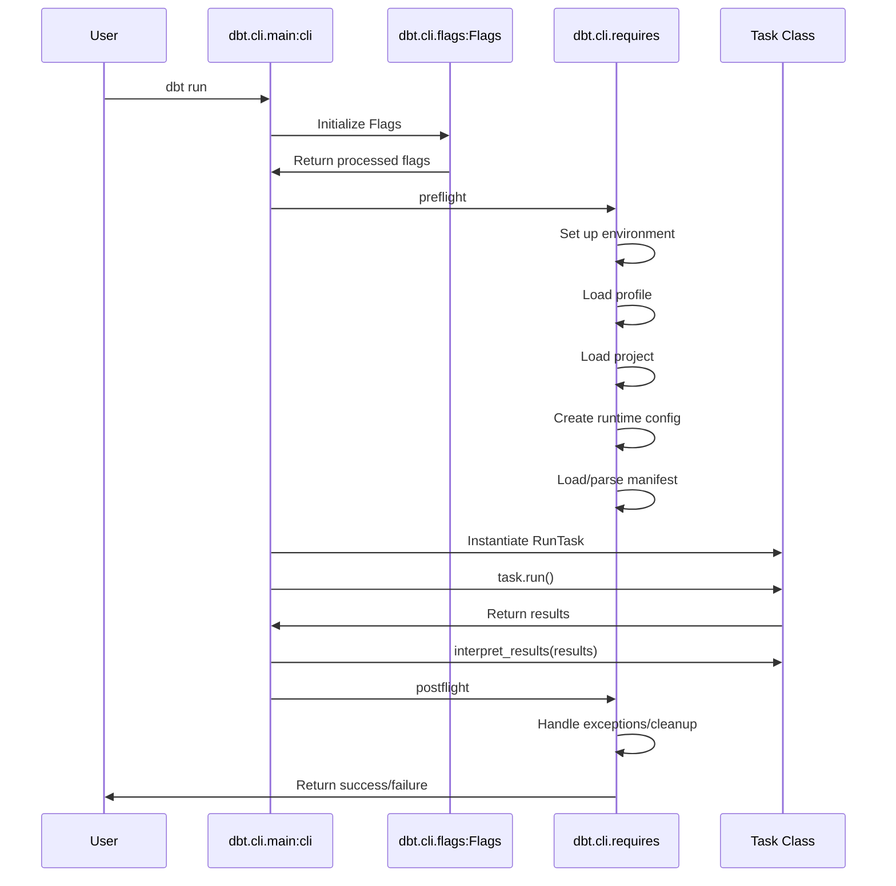
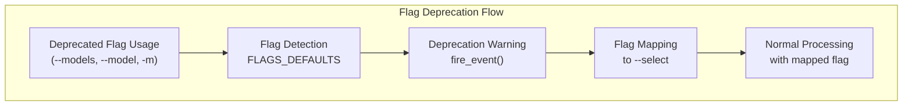
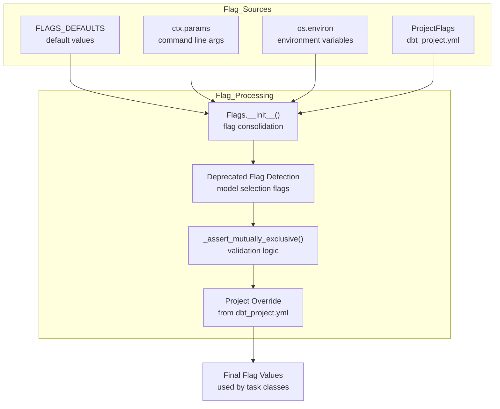
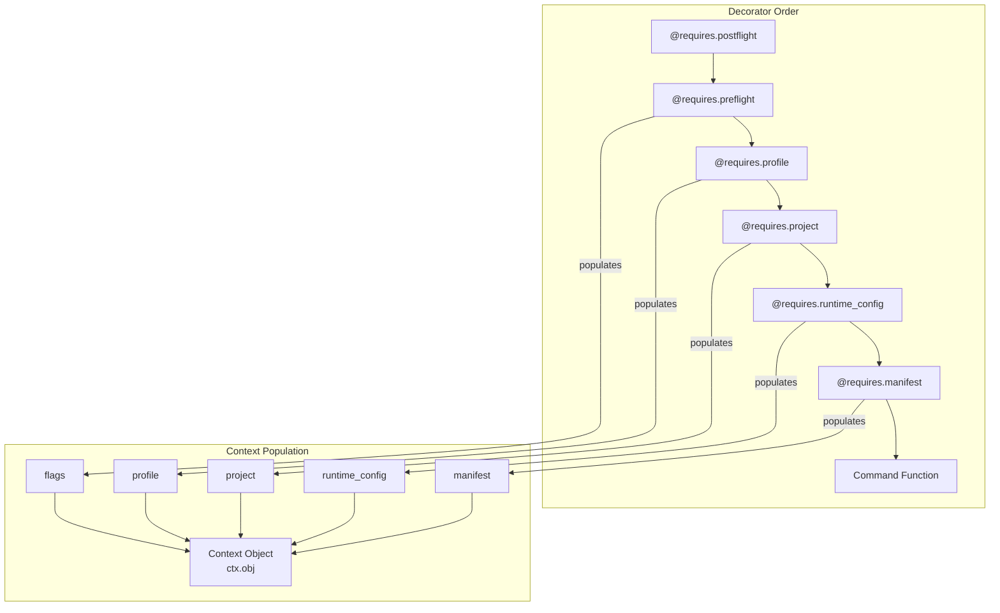
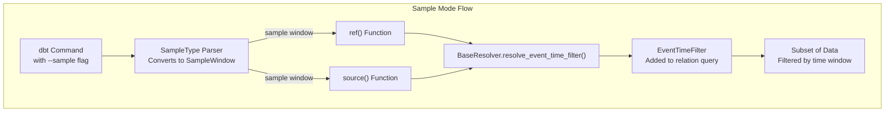
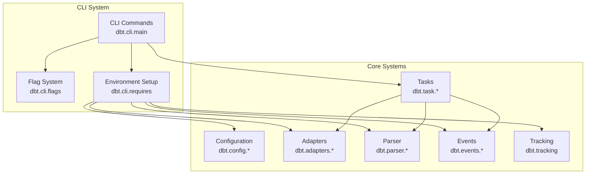

# CLI System

<details>
<summary>Relevant source files</summary>

The following files were used as context for generating this wiki page:

- [.changes/unreleased/Features-20250611-160217.yaml](https://github.com/dbt-labs/dbt-core/blob/64b58ec6/.changes/unreleased/Features-20250611-160217.yaml)

</details>


The CLI System in dbt-core provides the command-line interface that users interact with as well as a programmatic API through the `dbtRunner` class. It handles command parsing, flag validation, environment setup, and command execution.

This document focuses on how dbt's CLI system is implemented: the code structure, key components, and execution flow. For information about the programmatic API, see [dbtRunner and Programmatic Interface](#4.1).

## Command Structure

The CLI system is built using the Click library and follows a hierarchical command structure. The CLI system is primarily implemented in these files:

- `core/dbt/cli/main.py`: Defines the CLI commands and the `dbtRunner` class
- `core/dbt/cli/params.py`: Defines the command-line parameters and flags
- `core/dbt/cli/flags.py`: Processes and validates flags
- `core/dbt/cli/requires.py`: Provides decorators for setting up the execution environment
- `core/dbt/cli/option_types.py`: Defines custom parameter types

### CLI Architecture



Sources: [core/dbt/cli/main.py:153-169](https://github.com/dbt-labs/dbt-core/blob/64b58ec6/core/dbt/cli/main.py#L153-L169), [core/setup.py:41-47](https://github.com/dbt-labs/dbt-core/blob/64b58ec6/core/setup.py#L41-L47)

### Entry Point

The CLI entry point is defined in `setup.py` using Python's entry points system:

```python
# From core/setup.py
entry_points={
    "console_scripts": ["dbt = dbt.cli.main:cli"],
},
```

This maps the `dbt` command to the `cli` function in `dbt.cli.main`. The `cli` function is a Click command group that contains all dbt commands.

Sources: [core/setup.py:41-47](https://github.com/dbt-labs/dbt-core/blob/64b58ec6/core/setup.py#L41-L47)

## Commands and Task Mapping

Each CLI command is defined as a function decorated with `@cli.command()` and follows a consistent pattern:

```mermaid
graph TD
    subgraph "Command Definition Pattern"
        CMD["@cli.command('command_name')"]
        CTX["@click.pass_context"]
        GFLAGS["@global_flags"]
        CFLAGS["Command-specific flags"]
        REQP["@requires.postflight"]
        REQPF["@requires.preflight"]
        REQPROF["@requires.profile"]
        REQPROJ["@requires.project"]
        REQRC["@requires.runtime_config"]
        REQMAN["@requires.manifest"]
        FN["def command_name(ctx, **kwargs)"]
        TASK["task = TaskClass(...)"]
        RUN["results = task.run()"]
        INT["success = task.interpret_results(results)"]
        RET["return results, success"]
    end
    
    CMD --> CTX
    CTX --> GFLAGS
    GFLAGS --> CFLAGS
    CFLAGS --> REQP
    REQP --> REQPF
    REQPF --> REQPROF
    REQPROF --> REQPROJ
    REQPROJ --> REQRC
    REQRC --> REQMAN
    REQMAN --> FN
    FN --> TASK
    TASK --> RUN
    RUN --> INT
    INT --> RET
```



Sources: [core/dbt/cli/main.py:169-837](https://github.com/dbt-labs/dbt-core/blob/64b58ec6/core/dbt/cli/main.py#L169-L837)

Each command maps to a corresponding task class:

| Command    | Task Class             | File                       |
|------------|------------------------|----------------------------|
| run        | RunTask                | dbt/task/run.py            |
| build      | BuildTask              | dbt/task/build.py          |
| compile    | CompileTask            | dbt/task/compile.py        |
| test       | TestTask               | dbt/task/test.py           |
| seed       | SeedTask               | dbt/task/seed.py           |
| snapshot   | SnapshotTask           | dbt/task/snapshot.py       |
| parse      | (returns manifest)     | N/A                        |
| docs       | GenerateTask/ServeTask | dbt/task/docs/*.py         |
| debug      | DebugTask              | dbt/task/debug.py          |
| deps       | DepsTask               | dbt/task/deps.py           |
| clean      | CleanTask              | dbt/task/clean.py          |

Sources: [core/dbt/cli/main.py:169-837](https://github.com/dbt-labs/dbt-core/blob/64b58ec6/core/dbt/cli/main.py#L169-L837)

## Command Execution Flow



Sources: [core/dbt/cli/main.py:169-587](https://github.com/dbt-labs/dbt-core/blob/64b58ec6/core/dbt/cli/main.py#L169-L587), [core/dbt/cli/requires.py:58-410](https://github.com/dbt-labs/dbt-core/blob/64b58ec6/core/dbt/cli/requires.py#L58-L410)

When a user executes a dbt command, the following happens:

1. The command is parsed by Click
2. The `Flags` class processes and validates flags
3. The `requires` decorators set up the execution environment
4. The appropriate task class is instantiated
5. The task's `run()` method is called
6. The task's `interpret_results()` method processes the results
7. The results and success status are returned

## Flag System

The flag system handles command-line options and their validation.

### Flag Definition

Flags are defined in `params.py` as Click options:

```python
# Example from core/dbt/cli/params.py
debug = click.option(
    "--debug/--no-debug",
    "-d/ ",
    envvar="DBT_DEBUG",
    help="Display debug logging during dbt execution. Useful for debugging and making bug reports.",
)
```

The `global_flags` decorator in `main.py` applies common flags to all commands:

```python
# From core/dbt/cli/main.py
def global_flags(func):
    @p.cache_selected_only
    @p.debug
    @p.defer
    # ... many more flags ...
    def wrapper(*args, **kwargs):
        return func(*args, **kwargs)
    return wrapper
```

Sources: [core/dbt/cli/params.py](https://github.com/dbt-labs/dbt-core/blob/64b58ec6/core/dbt/cli/params.py), [core/dbt/cli/main.py:101-150](https://github.com/dbt-labs/dbt-core/blob/64b58ec6/core/dbt/cli/main.py#L101-L150)

### Flag Deprecations

**Deprecated Model Selection Flags**

As of recent versions, several model selection flags have been deprecated:

| Deprecated Flag | Status | Recommended Alternative |
|-----------------|--------|------------------------|
| `--models` | Deprecated | Use `--select` instead |
| `--model` | Deprecated | Use `--select` instead |
| `-m` | Deprecated | Use `--select` instead |

**CLI Flag Deprecation System**



The deprecation system ensures backward compatibility while guiding users toward the current flag conventions. When deprecated flags are used, warning messages are emitted through the event system.

Sources: [.changes/unreleased/Features-20250611-160217.yaml](https://github.com/dbt-labs/dbt-core/blob/64b58ec6/.changes/unreleased/Features-20250611-160217.yaml), [core/dbt/cli/flags.py](https://github.com/dbt-labs/dbt-core/blob/64b58ec6/core/dbt/cli/flags.py)

### Flag Processing

**Flag Processing Pipeline**



The `Flags` class in `flags.py` processes flags through these steps:

1. **Default Value Application**: Uses `FLAGS_DEFAULTS` for initial values
2. **Command Line Processing**: Extracts `ctx.params` from Click context
3. **Environment Variable Processing**: Reads from `os.environ` with `DBT_` prefixes
4. **Deprecated Flag Handling**: Maps deprecated model selection flags to `--select`
5. **Project Override Application**: Applies settings from `dbt_project.yml`
6. **Mutual Exclusion Validation**: Validates incompatible flag combinations using `_assert_mutually_exclusive`
7. **Final Validation**: Performs additional validation (e.g., event time flags)

Sources: [core/dbt/cli/flags.py:87-390](https://github.com/dbt-labs/dbt-core/blob/64b58ec6/core/dbt/cli/flags.py#L87-L390)

## Environment Setup Decorators

The `requires.py` module provides decorators that set up the execution environment:



Sources: [core/dbt/cli/requires.py:58-410](https://github.com/dbt-labs/dbt-core/blob/64b58ec6/core/dbt/cli/requires.py#L58-L410)

These decorators:

1. `@requires.postflight`: Handles exception management and result processing
2. `@requires.preflight`: Sets up the execution environment (logging, tracking, etc.)
3. `@requires.profile`: Loads the profile configuration
4. `@requires.project`: Loads the project configuration
5. `@requires.runtime_config`: Creates a runtime configuration from the profile and project
6. `@requires.manifest`: Loads or creates the project manifest

## Programmatic Interface - dbtRunner

The `dbtRunner` class in `main.py` provides a programmatic interface to dbt:

```python
# Example usage
from dbt.cli.main import dbtRunner

# Initialize the runner
runner = dbtRunner()

# Invoke a command
result = runner.invoke(["run", "--models", "my_model"])

# Check the result
if result.success:
    print("Command succeeded!")
    print(result.result)  # The return value of the command
else:
    print("Command failed!")
    print(result.exception)  # The exception that caused the failure
```

The `dbtRunner` class:
- Takes an optional `manifest` parameter to reuse a previously parsed manifest
- Takes optional `callbacks` to receive events
- Has an `invoke()` method that takes command args as a list of strings
- Returns a `dbtRunnerResult` object with success status and result/exception

Sources: [core/dbt/cli/main.py:23-97](https://github.com/dbt-labs/dbt-core/blob/64b58ec6/core/dbt/cli/main.py#L23-L97), [tests/functional/dbt_runner/test_dbt_runner.py:14-166](https://github.com/dbt-labs/dbt-core/blob/64b58ec6/tests/functional/dbt_runner/test_dbt_runner.py#L14-L166)

## Special Features

### Sample Mode

The CLI system includes a "sample mode" feature, which allows running commands on a subset of data:

```python
# From core/dbt/cli/params.py
sample = click.option(
    "--sample",
    envvar="DBT_SAMPLE",
    help="Run in sample mode with given SAMPLE_WINDOW spec, such that ref/source calls are sampled by the sample window.",
    default=None,
    type=SampleType(),
    hidden=True,  # TODO: Unhide
)
```

Sample mode works with models, seeds, and snapshots that have an `event_time` configuration by filtering data based on a time window:



Sources: [core/dbt/cli/params.py:527-534](https://github.com/dbt-labs/dbt-core/blob/64b58ec6/core/dbt/cli/params.py#L527-L534), [core/dbt/context/providers.py:245-301](https://github.com/dbt-labs/dbt-core/blob/64b58ec6/core/dbt/context/providers.py#L245-L301), [tests/functional/sample_mode/test_sample_mode.py:110-366](https://github.com/dbt-labs/dbt-core/blob/64b58ec6/tests/functional/sample_mode/test_sample_mode.py#L110-L366), [core/dbt/cli/option_types.py:97-121](https://github.com/dbt-labs/dbt-core/blob/64b58ec6/core/dbt/cli/option_types.py#L97-L121)

### Version Information

The CLI system provides version information through the `--version` flag, displaying the installed version of dbt-core and any plugins:

```python
# From core/dbt/version.py
def get_version_information() -> str:
    installed = get_installed_version()
    latest = get_latest_version()

    core_msg_lines, core_info_msg = _get_core_msg_lines(installed, latest)
    core_msg = _format_core_msg(core_msg_lines)
    plugin_version_msg = _get_plugins_msg()

    msg_lines = [core_msg]

    if core_info_msg != "":
        msg_lines.append(core_info_msg)

    msg_lines.append(plugin_version_msg)
    msg_lines.append("")

    return "\n\n".join(msg_lines)
```

Sources: [core/dbt/version.py:16-33](https://github.com/dbt-labs/dbt-core/blob/64b58ec6/core/dbt/version.py#L16-L33), [core/dbt/cli/params.py:720-740](https://github.com/dbt-labs/dbt-core/blob/64b58ec6/core/dbt/cli/params.py#L720-L740)

## Integration with Other Systems



Sources: [core/dbt/cli/requires.py:58-410](https://github.com/dbt-labs/dbt-core/blob/64b58ec6/core/dbt/cli/requires.py#L58-L410), [core/dbt/cli/main.py:169-837](https://github.com/dbt-labs/dbt-core/blob/64b58ec6/core/dbt/cli/main.py#L169-L837)

The CLI system interacts with several other systems in dbt-core:
- **Configuration System**: Loads profiles and project settings
- **Adapter System**: Connects to the database
- **Task System**: Executes commands
- **Parser/Manifest System**: Parses project files and builds the manifest
- **Event System**: Logs events and handles tracking