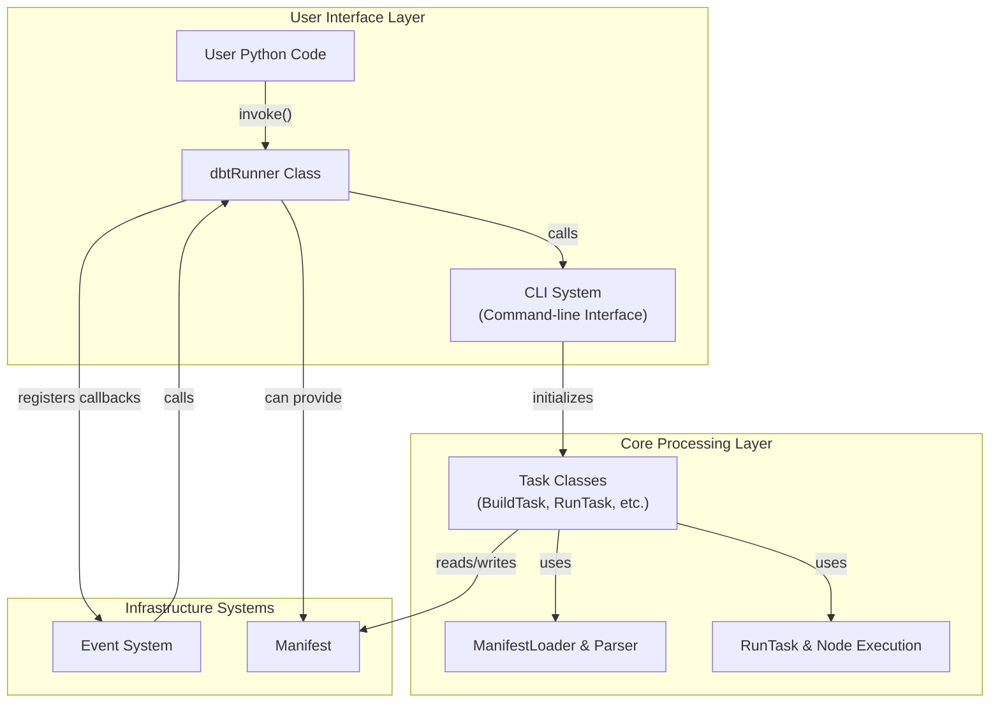
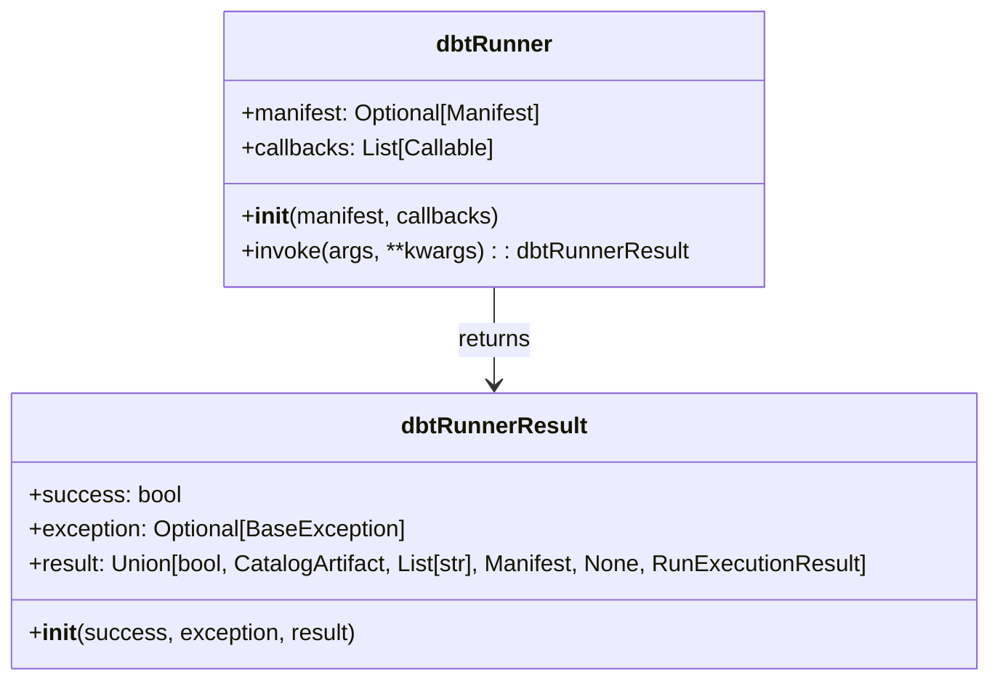
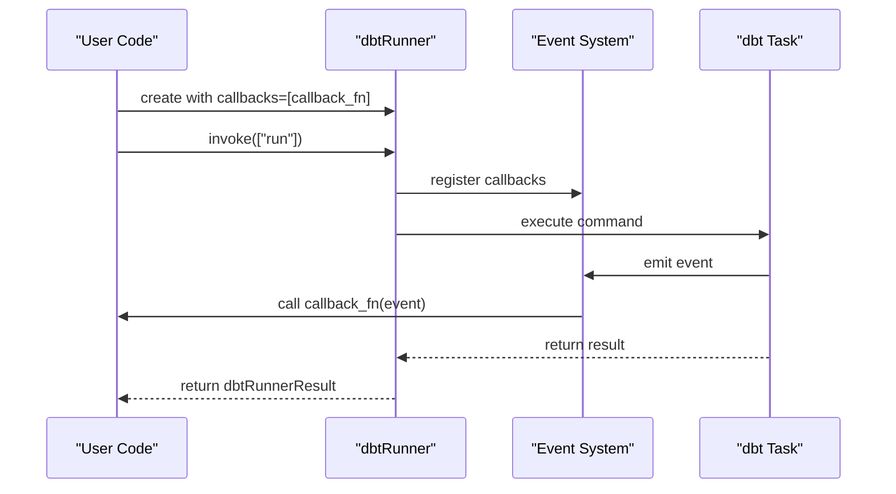

# dbtRunner and Programmatic Interface

<details>
<summary>Relevant source files</summary>

The following files were used as context for generating this wiki page:

- [.changes/unreleased/Features-20250611-160217.yaml](https://github.com/dbt-labs/dbt-core/blob/64b58ec6/.changes/unreleased/Features-20250611-160217.yaml)
- [.changes/unreleased/Features-20250703-175341.yaml](https://github.com/dbt-labs/dbt-core/blob/64b58ec6/.changes/unreleased/Features-20250703-175341.yaml)

</details>


This document covers the programmatic interface to dbt-core, specifically the `dbtRunner` class that allows users to invoke dbt commands from Python code rather than through the command line. This enables integration of dbt into larger Python applications, automated workflows, testing frameworks, or custom tooling built around dbt.

## Overview of dbtRunner

The `dbtRunner` class provides a programmatic way to execute dbt commands and capture their results. It serves as an alternative to using the command-line interface directly, allowing developers to:

1. Execute dbt commands from Python code
2. Capture structured results of command execution
3. Register callbacks to process events during execution
4. Reuse parsed manifest objects for improved performance

The class is designed to be a thin wrapper around the CLI system, providing the same functionality but with a Python interface instead of a command-line interface.

Sources: [core/dbt/cli/main.py:40-97](https://github.com/dbt-labs/dbt-core/blob/64b58ec6/core/dbt/cli/main.py#L40-L97)

## Architecture

The `dbtRunner` sits in the User Interface Layer of dbt-core, functioning as an alternative entry point to the CLI interface. Both interfaces ultimately invoke the same internal dbt components.



When a user invokes a command through `dbtRunner`, it:
1. Creates a CLI context with the provided arguments
2. Registers any user-provided callbacks with the event system
3. Provides any pre-loaded manifest if one was given
4. Executes the requested command through the CLI system
5. Captures the result and returns it in a structured format

Sources: [core/dbt/cli/main.py:42-97](https://github.com/dbt-labs/dbt-core/blob/64b58ec6/core/dbt/cli/main.py#L42-L97), [core/dbt/cli/requires.py:58-218](https://github.com/dbt-labs/dbt-core/blob/64b58ec6/core/dbt/cli/requires.py#L58-L218)

## dbtRunner Class

The `dbtRunner` class is defined in the `dbt.cli.main` module and provides the main entry point for programmatic use of dbt.



### Constructor

The `dbtRunner` constructor accepts two optional parameters:

- `manifest`: An optional pre-loaded `Manifest` object, which can be reused from a previous run to avoid reparsing the project
- `callbacks`: An optional list of callback functions that will be called when events occur during execution

### Method: invoke

The primary method of `dbtRunner` is `invoke`, which executes a dbt command:

```python
def invoke(self, args: List[str], **kwargs) -> dbtRunnerResult:
    """
    Executes a dbt command with the given arguments and returns a result object.
    
    Parameters:
        args: A list of command-line arguments (e.g., ["run", "--select", "my_model"])
        **kwargs: Additional parameters to override CLI arguments
        
    Returns:
        A dbtRunnerResult object containing success status, exception (if any), and result
    """
```

The `invoke` method:
1. Creates a click context with the provided arguments
2. Adds the manifest and callbacks to the context object
3. Applies any kwargs as parameter overrides
4. Invokes the command
5. Captures and returns the result in a `dbtRunnerResult` object

Sources: [core/dbt/cli/main.py:53-97](https://github.com/dbt-labs/dbt-core/blob/64b58ec6/core/dbt/cli/main.py#L53-L97)

### Exception Handling

The `invoke` method handles various types of exceptions that might occur during command execution:

- `requires.ResultExit`: Returns the result with success=False
- `requires.ExceptionExit`: Returns the exception with success=False
- Click exceptions (`BadOptionUsage`, `NoSuchOption`, `UsageError`): Converted to `DbtUsageException`
- `ClickExit`: Handled based on exit code
- Other exceptions: Returned as-is with success=False

Sources: [core/dbt/cli/main.py:71-97](https://github.com/dbt-labs/dbt-core/blob/64b58ec6/core/dbt/cli/main.py#L71-L97)

## dbtRunnerResult Class

The `dbtRunnerResult` class encapsulates the result of invoking a dbt command:

```python
@dataclass
class dbtRunnerResult:
    success: bool  # Whether the command executed successfully
    exception: Optional[BaseException] = None  # Any exception that occurred
    result: Union[  # Command-specific result object
        bool,  # debug
        CatalogArtifact,  # docs generate
        List[str],  # list/ls
        Manifest,  # parse
        None,  # clean, deps, init, source
        RunExecutionResult,  # build, compile, run, seed, snapshot, test, run-operation
    ] = None
```

The type of `result` depends on the command executed:
- `debug`: Boolean indicating success
- `docs generate`: `CatalogArtifact` object
- `list`/`ls`: List of strings
- `parse`: `Manifest` object
- `clean`/`deps`/`init`/`source`: None
- `build`/`compile`/`run`/`seed`/`snapshot`/`test`/`run-operation`: `RunExecutionResult` object

Sources: [core/dbt/cli/main.py:23-37](https://github.com/dbt-labs/dbt-core/blob/64b58ec6/core/dbt/cli/main.py#L23-L37)

## Usage Examples

### Basic Usage

```python
from dbt.cli.main import dbtRunner

# Create a dbtRunner instance
dbt = dbtRunner()

# Run a command
result = dbt.invoke(["run"])

# Check if the command succeeded
if result.success:
    print("Command executed successfully!")
else:
    print(f"Command failed: {result.exception}")
```

### Passing Command Arguments

```python
# Run with model selection
result = dbt.invoke(["run", "--select", "my_model"])

# Run with full-refresh
result = dbt.invoke(["run", "--full-refresh"])
```

### Passing Keyword Arguments

You can pass additional parameters as keyword arguments, which will override any CLI arguments:

```python
# Override configuration with kwargs
result = dbt.invoke(
    ["run"],
    log_format="json",  # Override --log-format
    log_path="logs/dbt.log",  # Override --log-path
    target="dev",  # Override --target
)
```

Sources: [tests/functional/dbt_runner/test_dbt_runner.py:58-72](https://github.com/dbt-labs/dbt-core/blob/64b58ec6/tests/functional/dbt_runner/test_dbt_runner.py#L58-L72)

### Error Handling

```python
# Handle potential errors
result = dbt.invoke(["run"])

if not result.success:
    if result.exception:
        if isinstance(result.exception, DbtUsageException):
            print("Usage error:", result.exception)
        elif isinstance(result.exception, DbtProjectError):
            print("Project error:", result.exception)
        else:
            print("Error:", result.exception)
```

Sources: [tests/functional/dbt_runner/test_dbt_runner.py:26-45](https://github.com/dbt-labs/dbt-core/blob/64b58ec6/tests/functional/dbt_runner/test_dbt_runner.py#L26-L45)

## Event Handling with Callbacks

The `dbtRunner` allows registering callback functions that will be called when events occur during execution:



### Defining a Callback Function

A callback function takes an `EventMsg` object and processes it:

```python
from dbt_common.events.base_types import EventMsg

def my_callback(event: EventMsg) -> None:
    # Process the event
    print(f"Event: {event.info}")

# Register the callback
dbt = dbtRunner(callbacks=[my_callback])

# Run a command
result = dbt.invoke(["run"])
```

Sources: [tests/functional/dbt_runner/test_dbt_runner.py:50-56](https://github.com/dbt-labs/dbt-core/blob/64b58ec6/tests/functional/dbt_runner/test_dbt_runner.py#L50-L56)

## Advanced Usage

### Reusing Manifests for Performance

One powerful feature of `dbtRunner` is the ability to reuse a previously parsed manifest, which can significantly improve performance for subsequent commands:

```python
# Parse the project once
parse_result = dbt.invoke(["parse"])
manifest = parse_result.result

# Use the manifest for subsequent commands
dbt_with_manifest = dbtRunner(manifest=manifest)
run_result = dbt_with_manifest.invoke(["run"])
test_result = dbt_with_manifest.invoke(["test"])
```

This avoids reparsing the project for each command, which can be a significant performance improvement for large projects.

Sources: [tests/functional/dbt_runner/test_dbt_runner.py:90-99](https://github.com/dbt-labs/dbt-core/blob/64b58ec6/tests/functional/dbt_runner/test_dbt_runner.py#L90-L99)

### Integration with Custom Applications

The `dbtRunner` can be integrated into larger Python applications, allowing for sophisticated workflows:

```python
def run_dbt_pipeline():
    dbt = dbtRunner()
    
    # Run deps to ensure packages are installed
    deps_result = dbt.invoke(["deps"])
    if not deps_result.success:
        raise Exception("Failed to install dependencies")
    
    # Parse the project
    parse_result = dbt.invoke(["parse"])
    if not parse_result.success:
        raise Exception("Failed to parse project")
    
    # Reuse the manifest for run and test
    manifest = parse_result.result
    dbt_with_manifest = dbtRunner(manifest=manifest)
    
    # Run models
    run_result = dbt_with_manifest.invoke(["run"])
    if not run_result.success:
        raise Exception("Failed to run models")
    
    # Test models
    test_result = dbt_with_manifest.invoke(["test"])
    if not test_result.success:
        raise Exception("Tests failed")
    
    return "Pipeline completed successfully"
```

## Sample Mode Usage

The dbtRunner interface also supports advanced features like sample mode, which allows testing or previewing data within specific time windows:

```python
# Run in sample mode with a relative time window
result = dbt.invoke(["run", "--sample=1 day"])

# Run in sample mode with specific start and end dates
result = dbt.invoke(["run", "--sample={'start': '2023-01-01', 'end': '2023-01-02'}"])
```

The sample mode is particularly useful for testing incremental models or working with time-series data.

Sources: [tests/functional/sample_mode/test_sample_mode.py:149-174](https://github.com/dbt-labs/dbt-core/blob/64b58ec6/tests/functional/sample_mode/test_sample_mode.py#L149-L174), [core/dbt/cli/option_types.py:97-122](https://github.com/dbt-labs/dbt-core/blob/64b58ec6/core/dbt/cli/option_types.py#L97-L122)

## Conclusion

The `dbtRunner` class provides a powerful, programmatic interface to dbt that enables integration with Python applications and automated workflows. By understanding its architecture, methods, and usage patterns, developers can leverage dbt's capabilities in more flexible and automated ways beyond the command line.