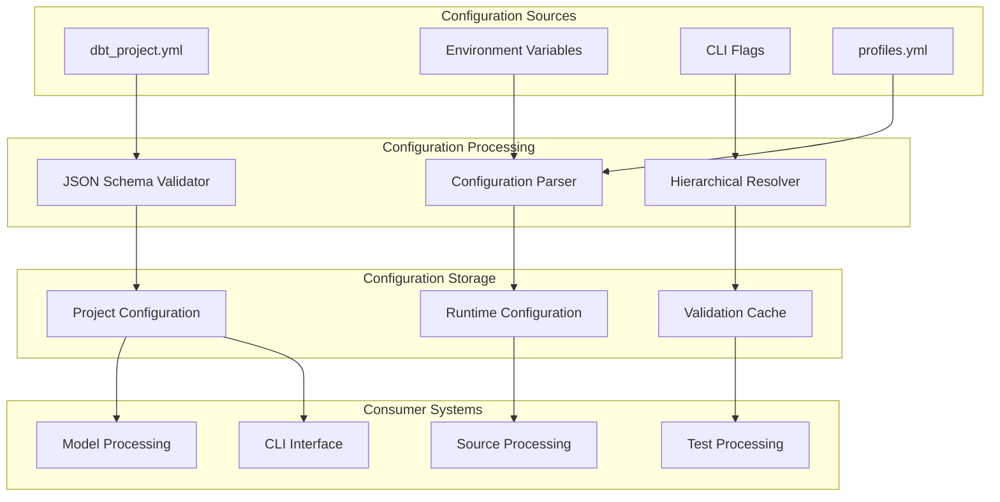
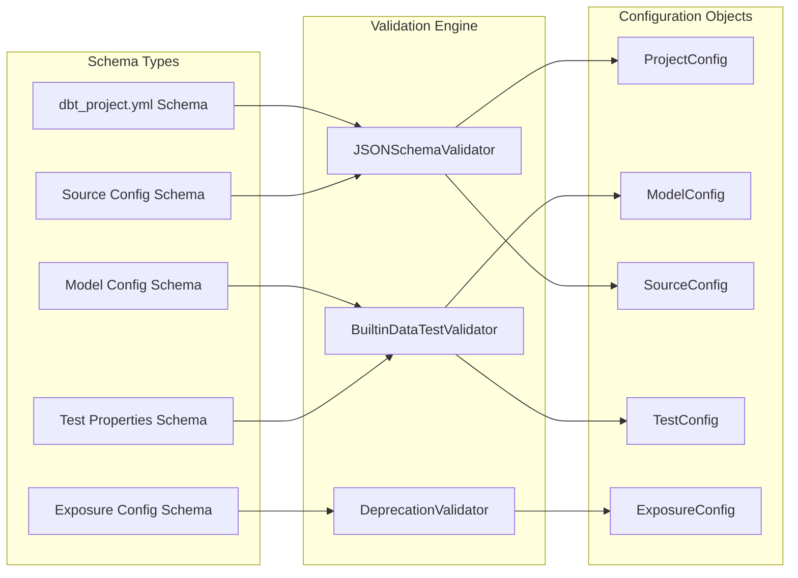
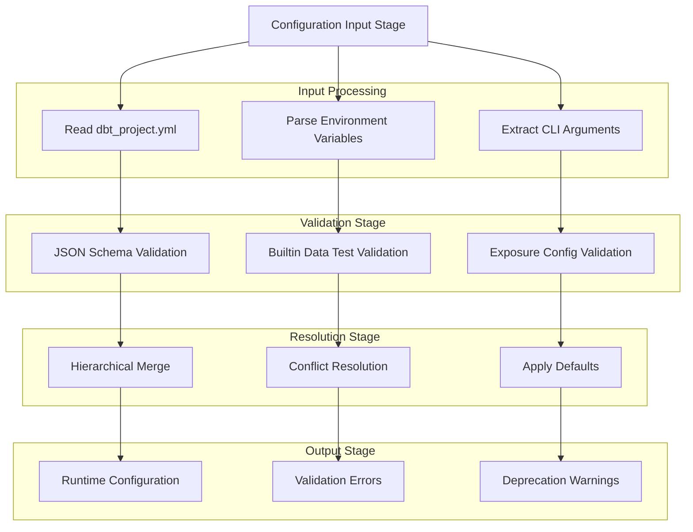
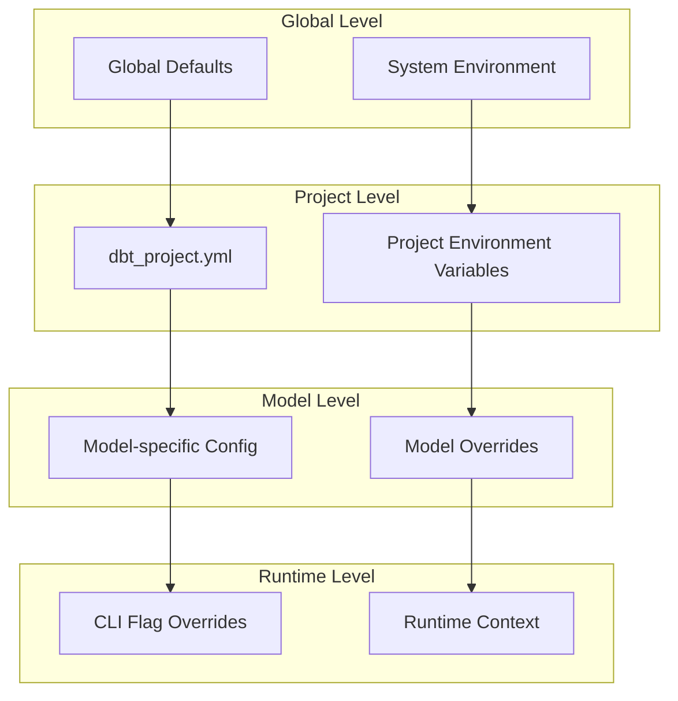
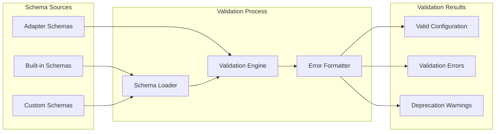

# Configuration System

Relevant source files

The following files were used as context for generating this wiki page:

- [.changes/unreleased/Features-20250617-142516.yaml](https://github.com/dbt-labs/dbt-core/blob/64b58ec6/.changes/unreleased/Features-20250617-142516.yaml)

## Purpose and Scope

The Configuration System manages all project-level configuration in dbt-core, including schema validation, configuration parsing, and the hierarchical resolution of settings across multiple sources. This system processes `dbt_project.yml` files, validates configurations against JSON schemas, and provides a unified interface for accessing configuration data throughout the dbt execution pipeline.

For information about project-specific configuration schemas and catalog integration, see [Project Configuration and Schema](#5.1). For details about hierarchical configuration parsing and nested configuration management, see [Hierarchical Configuration Parsing](#5.2).

## Configuration Architecture Overview

The Configuration System serves as the foundation for all dbt operations by managing how configuration data flows from various sources into the execution environment. It handles validation, parsing, and resolution of configuration conflicts across multiple hierarchical levels.

Sources: `.changes/unreleased/Features-20250617-142516.yaml`

## Configuration Types and Schema Validation

The system manages multiple configuration types through a comprehensive JSON schema validation framework. Each configuration type has specific validation rules and processing requirements.

Sources: `.changes/unreleased/Features-20250617-142516.yaml`

## Configuration Processing Pipeline

The configuration processing follows a structured pipeline that validates, parses, and resolves configuration data from multiple sources with proper precedence handling.

| Processing Stage | Input Sources | Validation Type | Output |
|-----------------|---------------|-----------------|---------|
| Schema Validation | `dbt_project.yml`, model configs | JSON Schema | Validated config objects |
| Hierarchical Resolution | CLI flags, env vars, project configs | Precedence rules | Merged configuration |
| Runtime Application | Merged config, context data | Runtime validation | Active configuration |
| Deprecation Checking | All config sources | Deprecation rules | Warning notifications |

Sources: `.changes/unreleased/Features-20250617-142516.yaml`

## Configuration Precedence and Hierarchical Resolution

The system implements a multi-level precedence system where configuration values are resolved based on their source priority and specificity.

### Configuration Precedence Order

1. **CLI Flags** - Highest precedence, runtime-specific
2. **Environment Variables** - System-level overrides
3. **Project Configuration** - Project-specific settings in `dbt_project.yml`
4. **Default Values** - Built-in system defaults

### Hierarchical Configuration Structure

Sources: `.changes/unreleased/Features-20250617-142516.yaml`

## JSON Schema Integration and Validation

The Configuration System integrates deeply with JSON Schema validation to ensure configuration accuracy and provide meaningful error messages for invalid configurations.

### Schema Validation Components

- **Built-in Data Test Properties**: Validates test configuration properties against schema definitions
- **Exposure Configuration Validation**: Ensures exposure configurations conform to expected structure
- **Deprecation-Aware Validation**: Provides warnings for deprecated configuration patterns

### Validation Error Handling

The system provides structured validation error reporting that includes:
- Schema violation details
- Suggested corrections
- Deprecation warnings with migration guidance
- Context information for debugging

Sources: `.changes/unreleased/Features-20250617-142516.yaml`

## Integration with Other Systems

The Configuration System serves as a central hub that provides configuration data to all other major systems in dbt-core.

### System Integration Points

| Consumer System | Configuration Data Used | Integration Method |
|----------------|------------------------|-------------------|
| Model Processing | Model configs, project settings | Direct config object access |
| Source Processing | Source configs, freshness settings | Configuration injection |
| Test Processing | Test properties, validation rules | Schema-validated configs |
| CLI Interface | Runtime flags, environment settings | Hierarchical resolution |

### Configuration Distribution Pattern

The system uses a centralized configuration distribution pattern where validated configuration objects are passed to consuming systems rather than having each system parse configuration independently.