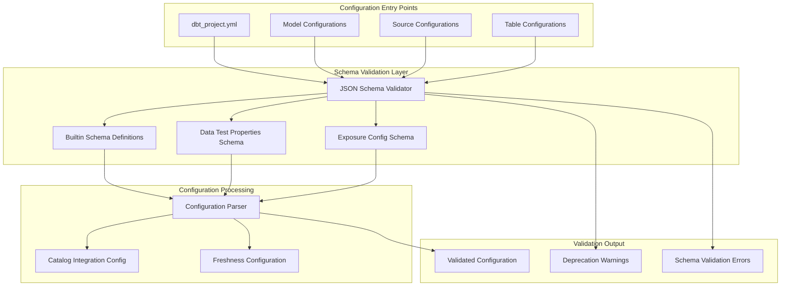
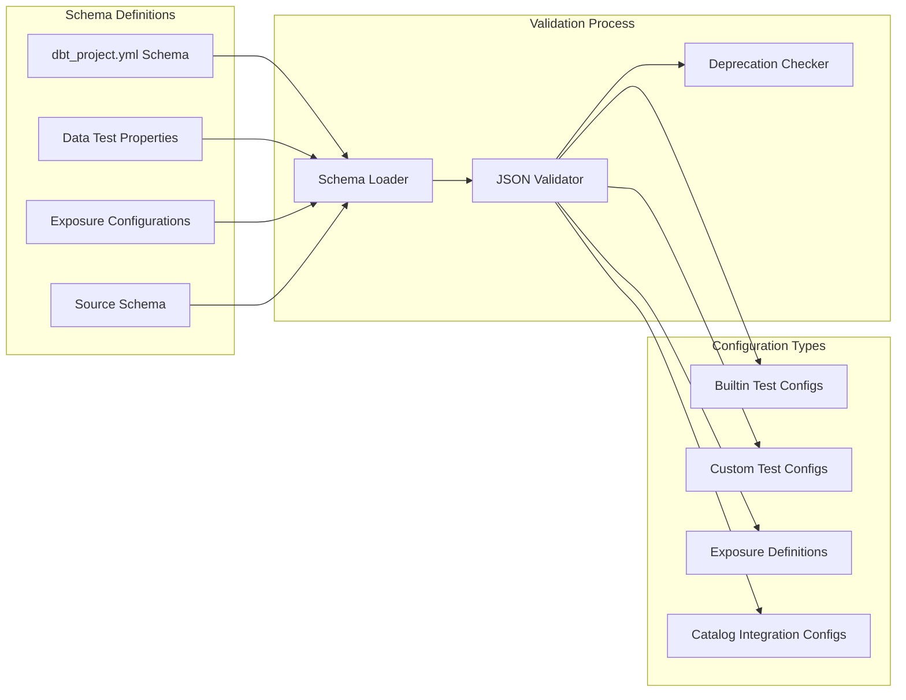
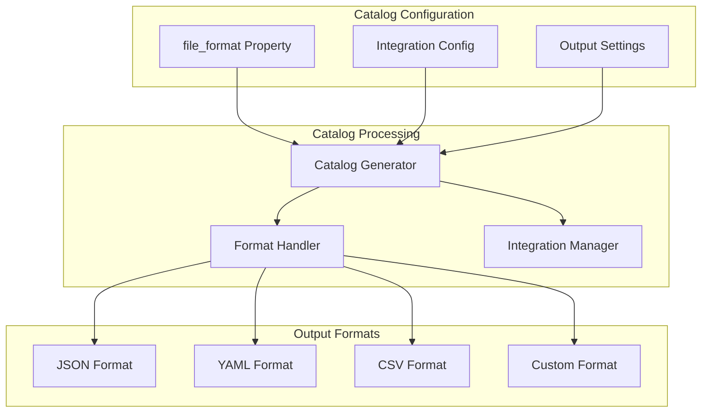
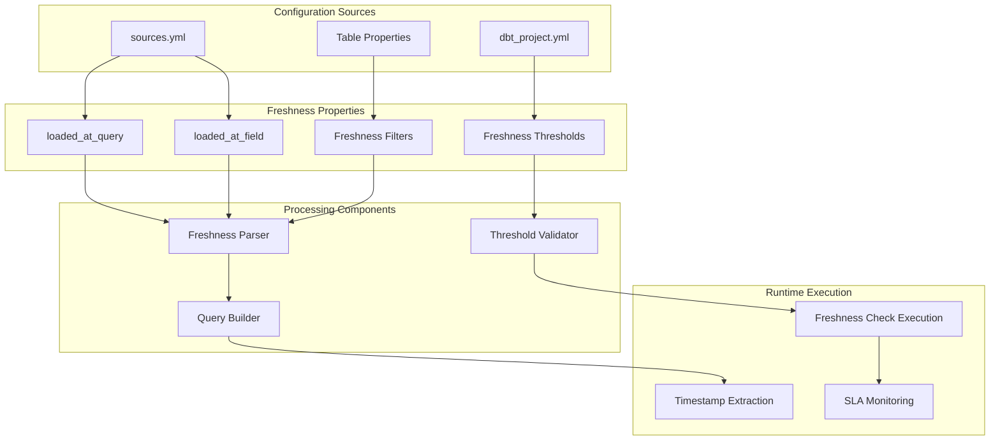
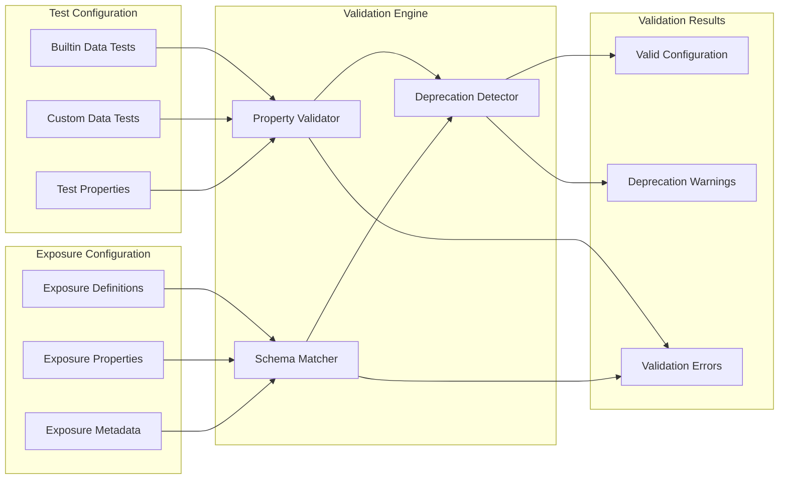

# Project Configuration and Schema

Relevant source files

The following files were used as context for generating this wiki page:

- [.changes/unreleased/Features-20250529-085311.yaml](https://github.com/dbt-labs/dbt-core/blob/64b58ec6/.changes/unreleased/Features-20250529-085311.yaml)
- [.changes/unreleased/Features-20250617-142516.yaml](https://github.com/dbt-labs/dbt-core/blob/64b58ec6/.changes/unreleased/Features-20250617-142516.yaml)
- [.changes/unreleased/Features-20250623-113130.yaml](https://github.com/dbt-labs/dbt-core/blob/64b58ec6/.changes/unreleased/Features-20250623-113130.yaml)

## Purpose and Scope

This document covers dbt-core's project-level configuration management system, focusing on the `dbt_project.yml` schema validation, catalog integration configurations, and the underlying JSON schema framework that validates project configurations. This includes the schema definitions for data test properties, exposure configurations, and source/table-level settings.

For information about hierarchical configuration parsing and nested configuration management, see [Hierarchical Configuration Parsing](#5.2). For CLI-level configuration handling, see [Command Interface and Deprecations](#4.1).

## dbt_project.yml Schema System Overview

The dbt project configuration system centers around the `dbt_project.yml` file, which serves as the primary configuration entry point for dbt projects. The system uses JSON schema validation to ensure configuration correctness and provides structured configuration parsing.

Sources: `.changes/unreleased/Features-20250617-142516.yaml`

## JSON Schema Validation Framework

The configuration validation system relies on JSON schemas to enforce structure and data types for various configuration sections. This framework has been enhanced to include builtin data test properties and exposure configurations directly in the `dbt_project.yml` schema definitions.

### Schema Validation Components

| Component | Purpose | Key Features |
|-----------|---------|--------------|
| **JSON Schema Validator** | Core validation engine | Type checking, required fields, format validation |
| **Builtin Data Test Properties** | Validates test configurations | Supports standard dbt test properties |
| **Exposure Config Schema** | Validates exposure definitions | Ensures proper exposure configuration structure |
| **Deprecation Detection** | Identifies deprecated configurations | Provides migration guidance |

Sources: `.changes/unreleased/Features-20250617-142516.yaml`

## Catalog Integration Configuration

The catalog integration system has been extended to support additional configuration options, including file format specifications. This allows dbt to better integrate with various catalog systems and data discovery tools.

### Catalog Configuration Properties

The catalog integration configuration includes:

- **File Format Configuration**: Specifies the format for catalog output files
- **Integration Settings**: Controls how dbt interacts with external catalog systems  
- **Output Formatting**: Manages the structure and format of catalog data

Sources: `.changes/unreleased/Features-20250529-085311.yaml`

## Source and Table Configuration Properties

The configuration system supports freshness tracking properties at both source and table levels. This includes `loaded_at_query` and `loaded_at_field` configurations that enable dbt to determine data freshness automatically.

### Freshness Configuration Structure

| Configuration | Level | Purpose | Example Use Case |
|---------------|-------|---------|------------------|
| `loaded_at_query` | Source/Table | Custom SQL query to determine load time | Complex timestamp logic |
| `loaded_at_field` | Source/Table | Field name containing load timestamp | Simple timestamp column |
| **Freshness Thresholds** | Source/Table | Warning and error thresholds | SLA monitoring |
| **Freshness Filters** | Source/Table | Additional filtering conditions | Conditional freshness checks |

Sources: `.changes/unreleased/Features-20250623-113130.yaml`

## Data Test and Exposure Configuration Schema

The schema validation system includes comprehensive support for data test properties and exposure configurations within the `dbt_project.yml` file. This enables more accurate deprecation warnings and better configuration validation.

### Configuration Validation Flow

The validation process ensures that both builtin and custom configurations conform to expected schemas:

1. **Schema Loading**: Load appropriate schema definitions for the configuration type
2. **Property Validation**: Validate individual properties against their schema definitions  
3. **Deprecation Checking**: Identify deprecated configuration patterns
4. **Error Reporting**: Provide detailed validation error messages

