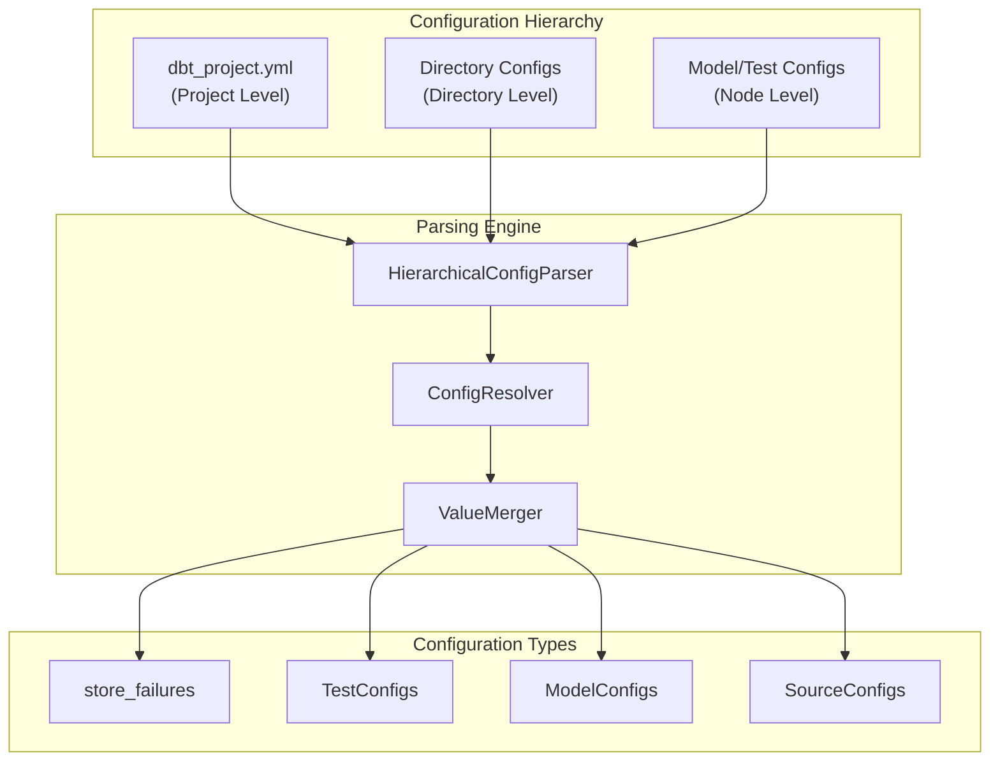
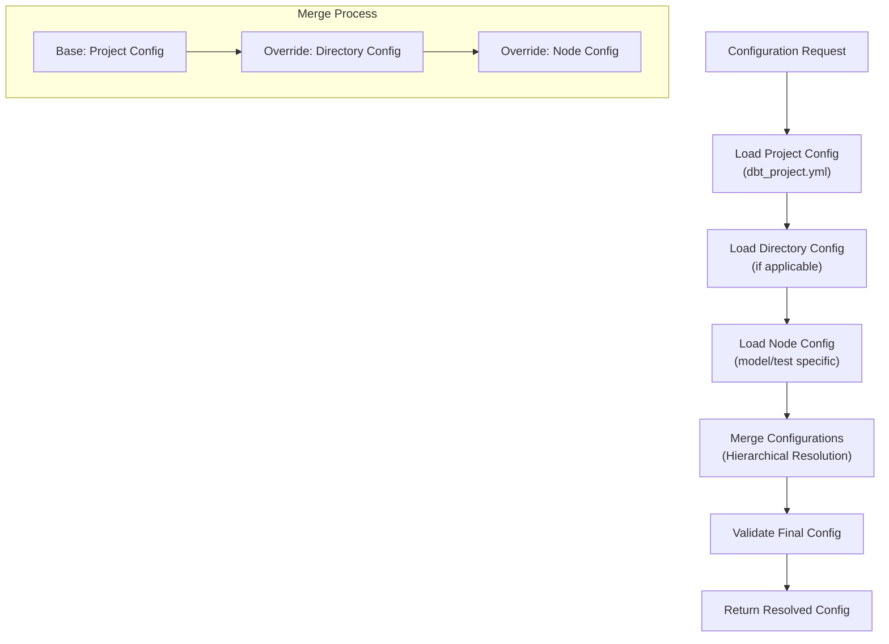
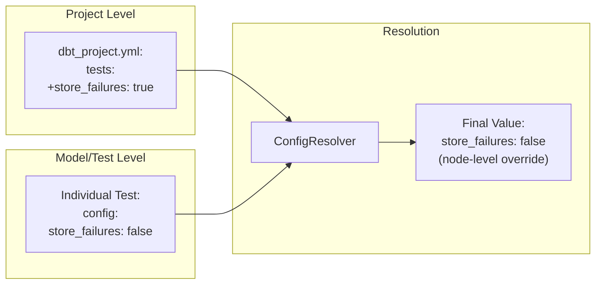
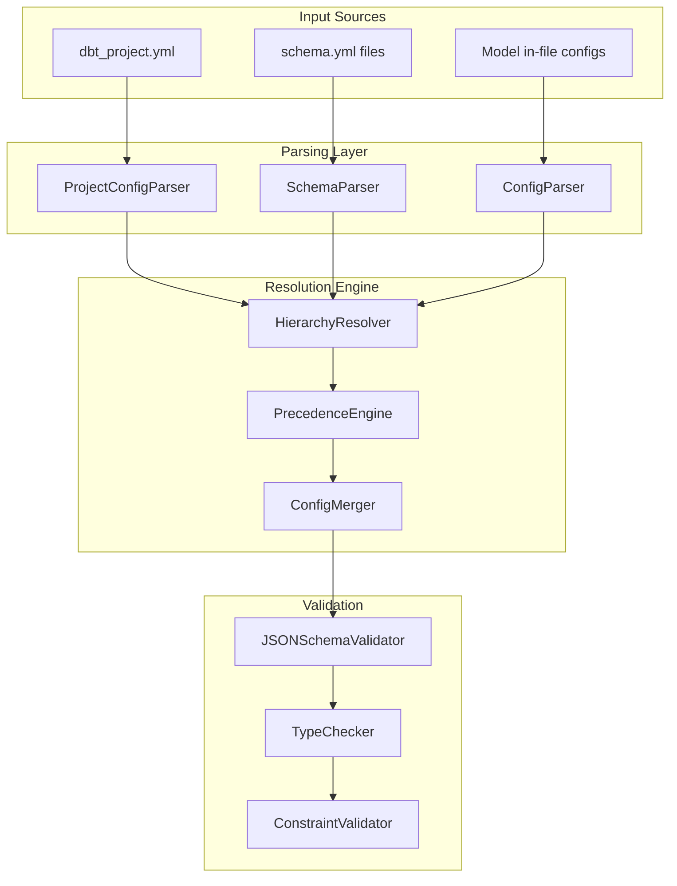

# Hierarchical Configuration Parsing

Relevant source files

The following files were used as context for generating this wiki page:

- [.changes/unreleased/Fixes-20250612-145159.yaml](https://github.com/dbt-labs/dbt-core/blob/64b58ec6/.changes/unreleased/Fixes-20250612-145159.yaml)

## Purpose and Scope

This document covers dbt-core's hierarchical configuration parsing system, which manages how configuration values are resolved across multiple levels of the project hierarchy. The system handles configuration precedence, inheritance, and overrides for settings like `store_failures`, test configurations, and other model properties.

For information about project-level configuration schemas, see [Project Configuration and Schema](#5.1). For general configuration validation, see [Configuration Validation and JSON Schema](#3.1).

## Overview

dbt-core implements a hierarchical configuration system that allows configurations to be defined at multiple levels and resolved according to precedence rules. This enables flexible configuration management where settings can be defined broadly at the project level and selectively overridden at more specific levels.

*Sources: .changes/unreleased/Fixes-20250612-145159.yaml*

## Configuration Levels and Precedence

The hierarchical configuration parsing system resolves configurations across multiple levels, with more specific levels taking precedence over general ones:

| Level | Scope | Configuration Source | Precedence |
|-------|--------|---------------------|------------|
| Project | Global | `dbt_project.yml` | Lowest |
| Directory | Path-based | Directory-level configs | Medium |
| Node | Individual models/tests | In-file configs, schema.yml | Highest |

### Configuration Resolution Process

*Sources: .changes/unreleased/Fixes-20250612-145159.yaml*

## Store Failures Configuration Example

The `store_failures` configuration demonstrates hierarchical parsing behavior. This configuration can be defined at multiple levels and needs proper precedence resolution:

### Configuration Levels for store_failures

### Common Issues and Fixes

The hierarchical parsing system has encountered issues with proper precedence resolution, particularly with the `store_failures` configuration:

**Issue #10165**: Fix for `store_failures` hierarchical config parsing ensures that node-level configurations properly override project-level defaults.

*Sources: .changes/unreleased/Fixes-20250612-145159.yaml*

## Implementation Architecture

The hierarchical configuration parsing system integrates with dbt-core's broader configuration validation framework:

*Sources: .changes/unreleased/Fixes-20250612-145159.yaml*

## Configuration Merging Strategies

The system employs different merging strategies depending on the configuration type:

| Configuration Type | Merge Strategy | Behavior |
|-------------------|----------------|----------|
| Simple Values | Override | Later values completely replace earlier ones |
| Lists | Append/Override | Configurable - either append or replace |
| Dictionaries | Deep Merge | Recursive merging of nested structures |
| Boolean Flags | Override | Direct replacement (e.g., `store_failures`) |

### Deep Merge Example

For complex configurations, the system performs deep merging to combine settings from different levels while preserving granular overrides.