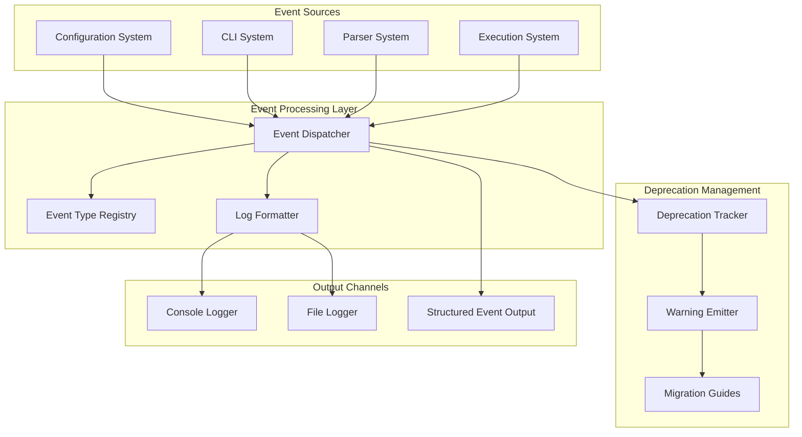
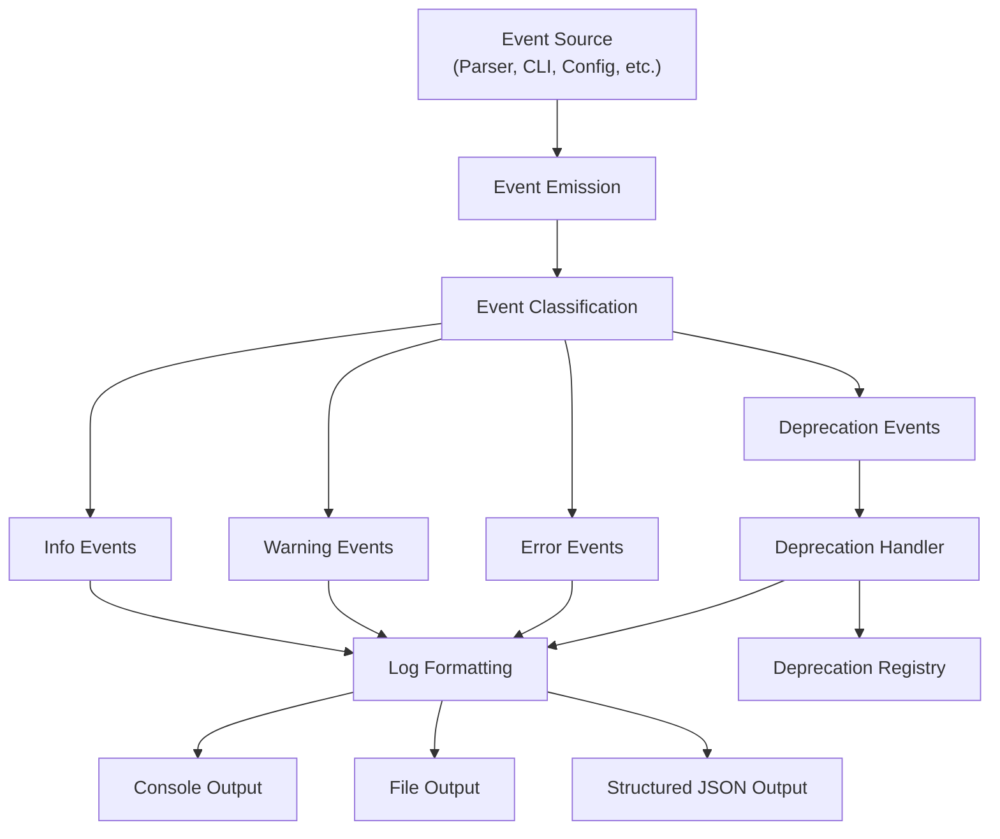
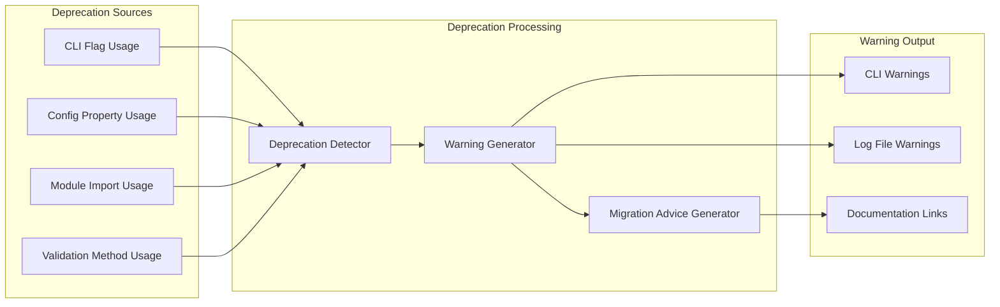
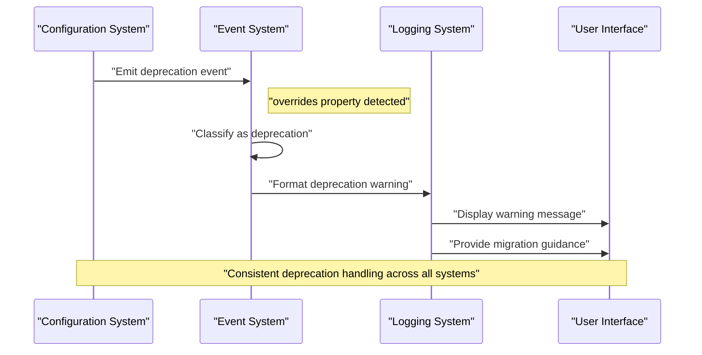

# Event and Logging System

Relevant source files

The following files were used as context for generating this wiki page:

- [.changes/unreleased/Features-20250701-164957.yaml](https://github.com/dbt-labs/dbt-core/blob/64b58ec6/.changes/unreleased/Features-20250701-164957.yaml)

## Purpose and Scope

The Event and Logging System in dbt-core provides centralized event handling, structured logging, and comprehensive deprecation management across all system components. This system coordinates event emission, log message formatting, and deprecation warning delivery to ensure consistent user communication and system observability.

For information about configuration validation events, see [Configuration Validation and JSON Schema](#3.1). For details about CLI command deprecation handling, see [Command Interface and Deprecations](#4.1).

## System Architecture

The Event and Logging System operates as a cross-cutting concern that integrates with all major dbt-core subsystems to provide unified event handling and user communication.

### Event and Logging System Architecture

Sources: System architecture inferred from overall dbt-core system design patterns

## Event Handling Infrastructure

The event handling system processes events from across the dbt-core codebase, providing structured logging and user notifications through multiple output channels.

### Event Processing Flow

Sources: Event flow patterns inferred from deprecation management requirements

## Deprecation Management System

The deprecation management system provides structured handling of deprecated features across dbt-core, ensuring users receive appropriate warnings and migration guidance.

### Deprecation Categories and Handling

| Deprecation Category | Example Features | Warning Level | Migration Timeline |
|---------------------|------------------|---------------|-------------------|
| CLI Flags | `--models`, `--model`, `-m` | High Priority | Next Major Version |
| Configuration Properties | `overrides` for sources | Medium Priority | 2-3 Minor Versions |
| Module Imports | `modules.itertools` | Low Priority | Long-term |
| Validation Methods | `GenericJSONSchemaValidationDeprecation` | Technical | Internal Refactoring |

### Deprecation Warning System

Sources: [.changes/unreleased/Features-20250701-164957.yaml:1-7](https://github.com/dbt-labs/dbt-core/blob/64b58ec6/.changes/unreleased/Features-20250701-164957.yaml#L1-L7)

## Integration with System Components

The Event and Logging System integrates with all major dbt-core components to provide consistent event handling and user communication.

### Component Integration Matrix

| System Component | Event Types | Log Levels | Deprecation Features |
|-----------------|-------------|------------|---------------------|
| Configuration System | Config validation, schema errors | INFO, WARN, ERROR | Property deprecations |
| CLI System | Command execution, flag warnings | INFO, WARN, ERROR | Flag deprecations |
| Parser System | Model parsing, validation | INFO, WARN, ERROR, DEBUG | Syntax deprecations |
| Execution System | Query execution, test results | INFO, WARN, ERROR | Runtime deprecations |
| Dependency System | Version conflicts, updates | INFO, WARN | Dependency deprecations |

### Cross-System Event Flow

Sources: Deprecation management patterns inferred from system architecture

## Event Types and Categorization

The system maintains a registry of event types that correspond to different operational states and user actions throughout the dbt-core lifecycle.

### Event Type Hierarchy

```mermaid
graph TD
    RootEvent["dbt-core Events"] --> SystemEvents["System Events"]
    RootEvent --> UserEvents["User Events"]
    RootEvent --> ValidationEvents["Validation Events"]
    RootEvent --> DeprecationEvents["Deprecation Events"]
    
    SystemEvents --> StartupEvents["Startup Events"]
    SystemEvents --> ShutdownEvents["Shutdown Events"]
    SystemEvents --> ResourceEvents["Resource Events"]
    
    UserEvents --> CommandEvents["Command Events"]
    UserEvents --> ConfigEvents["Configuration Events"]
    UserEvents --> ExecutionEvents["Execution Events"]
    
    ValidationEvents --> SchemaEvents["Schema Validation Events"]
    ValidationEvents --> ModelEvents["Model Validation Events"]
    ValidationEvents --> SourceEvents["Source Validation Events"]
    
    DeprecationEvents --> CLIDeprecations["CLI Deprecations"]
    DeprecationEvents --> ConfigDeprecations["Config Deprecations"] 
    DeprecationEvents --> APIDeprecations["API Deprecations"]
```

Sources: Event categorization inferred from system components and deprecation requirements