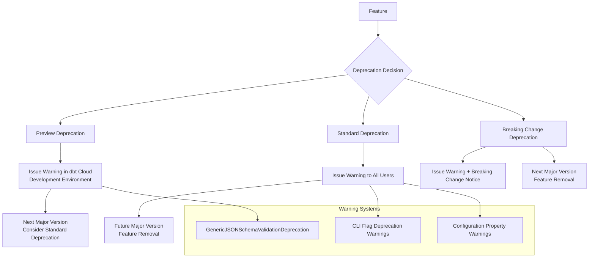
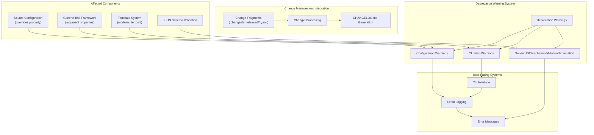
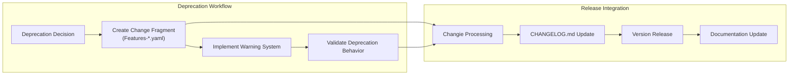

# Deprecation Management

Relevant source files

The following files were used as context for generating this wiki page:

- [.changes/unreleased/Features-20250701-164957.yaml](https://github.com/dbt-labs/dbt-core/blob/64b58ec6/.changes/unreleased/Features-20250701-164957.yaml)
- [.changes/unreleased/Features-20250721-173100.yaml](https://github.com/dbt-labs/dbt-core/blob/64b58ec6/.changes/unreleased/Features-20250721-173100.yaml)
- [.changes/unreleased/Features-20250728-115443.yaml](https://github.com/dbt-labs/dbt-core/blob/64b58ec6/.changes/unreleased/Features-20250728-115443.yaml)
- [.changes/unreleased/Fixes-20250710-170148.yaml](https://github.com/dbt-labs/dbt-core/blob/64b58ec6/.changes/unreleased/Fixes-20250710-170148.yaml)

This document covers dbt-core's deprecation management system, which handles the lifecycle of deprecated features, warning mechanisms, and migration paths for end users. The system provides structured deprecation warnings, version-based deprecation policies, and integration with the release management process.

For information about the broader event and logging infrastructure, see [Event and Logging System](#6). For release management and version control, see [Release Process and Version Management](#11.1).

## Deprecation Types and Lifecycle

dbt-core uses a structured approach to feature deprecations, with different deprecation types that correspond to different stages in the removal lifecycle.

**Sources:** `.changes/unreleased/Fixes-20250710-170148.yaml`

### Preview Deprecations

Preview deprecations are used for features that are being evaluated for removal but may still be retained based on user feedback. The `GenericJSONSchemaValidationDeprecation` is implemented as a "preview" deprecation, meaning it primarily affects dbt Cloud development environments rather than all users.

### Standard Deprecations

Standard deprecations apply to features that will be removed in future major versions. These generate warnings for all users and are typically maintained for at least one major version before removal.

## Current Active Deprecations

The following features are currently in various stages of deprecation:

| Feature | Type | Status | Target Removal | Issue |
|---------|------|--------|----------------|-------|
| `overrides` property for sources | Standard | Active | Future Major | #11566 |
| Top-level argument properties in generic tests | Standard | Active | Future Major | #11847 |
| `{{ modules.itertools }}` usage | Standard | Active | Future Major | #11725 |
| `GenericJSONSchemaValidationDeprecation` | Preview | Active | TBD | #11814 |

**Sources:** `.changes/unreleased/Features-20250701-164957.yaml`, `.changes/unreleased/Features-20250721-173100.yaml`, `.changes/unreleased/Features-20250728-115443.yaml`, `.changes/unreleased/Fixes-20250710-170148.yaml`

## Deprecation Implementation Architecture

**Sources:** `.changes/unreleased/Features-20250701-164957.yaml`, `.changes/unreleased/Features-20250721-173100.yaml`, `.changes/unreleased/Features-20250728-115443.yaml`, `.changes/unreleased/Fixes-20250710-170148.yaml`

## Specific Deprecation Cases

### Source Configuration Overrides

The `overrides` property for sources has been deprecated as part of configuration system improvements. This deprecation affects source configuration parsing and validation.

### Generic Test Argument Properties

Top-level argument properties in generic tests are being deprecated in favor of a more structured approach to test configuration. This impacts the testing framework and test definition parsing.

### Template System Modules

The `{{ modules.itertools }}` usage pattern in dbt templates is being deprecated. Users should migrate to alternative approaches for iteration and collection handling in Jinja templates.

### JSON Schema Validation

The `GenericJSONSchemaValidationDeprecation` represents a preview deprecation for certain JSON schema validation patterns. This is implemented as a preview deprecation to minimize disruption while the team evaluates the impact.

## Integration with Release Process

Deprecation management is closely integrated with dbt-core's release management system through the changie-based changelog automation. Each deprecation generates a change fragment that becomes part of the official release documentation.

**Sources:** `.changes/unreleased/Features-20250701-164957.yaml`, `.changes/unreleased/Features-20250721-173100.yaml`, `.changes/unreleased/Features-20250728-115443.yaml`, `.changes/unreleased/Fixes-20250710-170148.yaml`

## Warning System Implementation

The deprecation warning system operates through multiple channels to ensure users are informed about deprecated functionality:

1. **CLI Warnings**: Generated during command execution when deprecated flags or options are used
2. **Configuration Warnings**: Issued during project parsing when deprecated configuration properties are encountered  
3. **Runtime Warnings**: Triggered during template rendering or model execution when deprecated patterns are detected
4. **Preview Environment Warnings**: Specific warnings that primarily target development environments in dbt Cloud

The warning system integrates with dbt-core's event logging infrastructure to ensure consistent message formatting and appropriate log levels for different deprecation types.